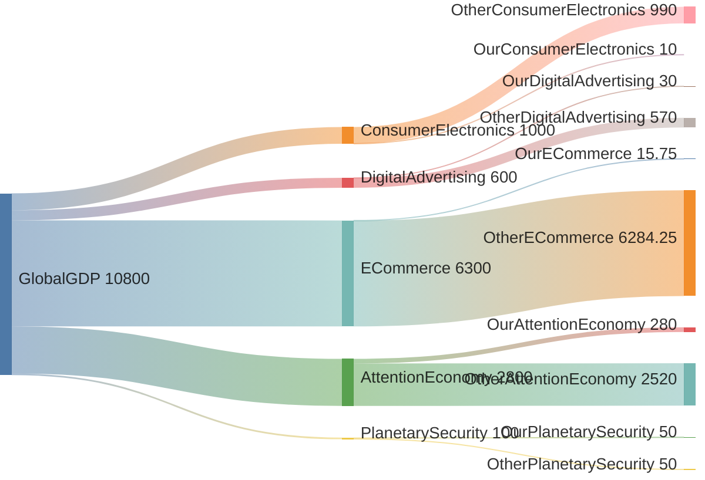

# 6. Market


```mermaid
sankey-beta  
GlobalGDP[$100T Global GDP] {
    OtherGDP[$88.92T Other GDP]
    
  ConsumerElectronics[$1T Consumer Electronics] {
    OtherConsumerElectronics[$990B Other Consumer Electronics]
    OurConsumerElectronics[$10B Our Share (1%)]
    }
    
    DigitalAdvertising[$600B Digital Advertising] {
      OtherDigitalAdvertising[$570B Other Digital Advertising]
      OurDigitalAdvertising[$30B Our Share (5%)]
    }
    
    ECommerce[$6.3T E-commerce] {
      OtherECommerce[$6.284T Other E-commerce]
      OurECommerce[$15.8B Our Share (0.25%)]
    }
    
    AttentionEconomy[$2.8T Attention Economy] {
      OtherAttentionEconomy[$2.52T Other Attention Economy]
      OurAttentionEconomy[$280B Our Share (10%)]
    }
    
    PlanetarySecurity[$100B Planetary Security] {
      OtherPlanetarySecurity[$50B Other Security]
      OurPlanetarySecurity[$50B Our Share (50%)]
    }
  }
```


<!-- ANCHOR: Market -->


<!-- ANCHOR_END: Market -->


<!-- ANCHOR: ID1 -->
LOVELLLYYYYY
<!-- ANCHOR_END: ID1 -->
