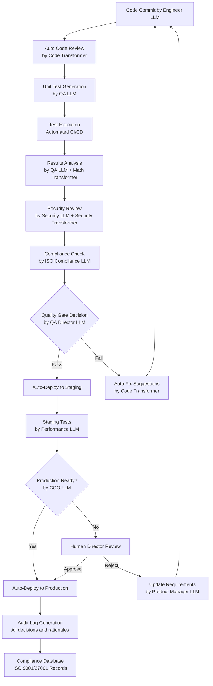
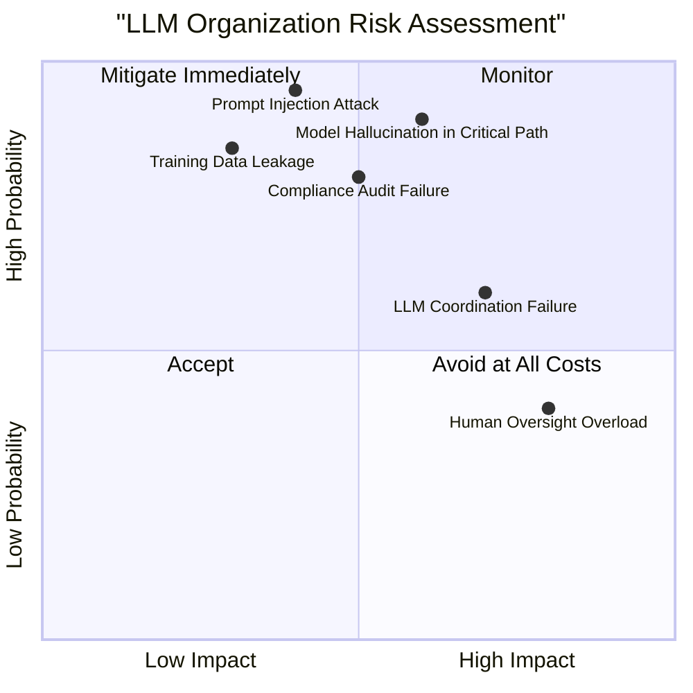

# CYBERNETICS GOVERNANCE


1. Executive Summary of Organizational Transformation

The MINI LX project adopts a revolutionary organizational structure where Large Language Models (LLMs) and Transformers serve as autonomous agents, managed through ISO-compliant prompt-based job descriptions. This transforms traditional human-centric project management into a cybernetic orchestration system where:

  - Every role is an LLM instance with precisely defined capabilities
  
  - Prompts function as ISO-compliant job descriptions
  
  - Transformers provide specialized reasoning capabilities
  
  - Humans serve as overseers and strategic directors
  
  - All interactions are auditable, version-controlled, and compliant

## 2. Complete Cybernetic Organizational Chart

```mermaid
graph TB
    %% Governance Layer
    Ethics_Board[Ethics Board<br/>Human Oversight Committee] --> CEO_LLM[CEO LLM<br/>GPT-4 Architecture<br/>Strategic Vision & P&L]
    %% Executive Layer
    CEO_LLM --> CTO_LLM[CTO LLM<br/>GPT-4 + Codex<br/>Technical Architecture & R&D]
    CEO_LLM --> CFO_LLM[CFO LLM<br/>GPT-4 + Financial Models<br/>Valuation & Capital Allocation]
    CEO_LLM --> COO_LLM[COO LLM<br/>GPT-4 + Process Models<br/>Operations & Scaling]
    %% Compliance & Security Layer
    CTO_LLM --> ISO_Compliance[ISO Compliance LLM<br/>Claude-3 + Legal Database<br/>9001/27001 Adherence]
    COO_LLM --> Security_LLM[Security LLM<br/>GPT-4 + Security Models<br/>Zero-Trust Architecture]
    CFO_LLM --> Regulatory_LLM[Regulatory LLM<br/>Legal-GPT + Global Regulations<br/>Cross-Border Compliance]
    %% Product Management Layer
    CTO_LLM --> Product_Director[Product Director LLM<br/>GPT-4 + Market Analysis<br/>Product Strategy]
    Product_Director --> B00T_PM[B00T Product Manager LLM<br/>Specialized: Boot Optimization]
    Product_Director --> Z00S_PM[Z00S Product Manager LLM<br/>Specialized: IDE/OS Integration]
    Product_Director --> H0T_PM[H0T Product Manager LLM<br/>Specialized: IoT Semantics]
    Product_Director --> H0S_PM[H0S Product Manager LLM<br/>Specialized: GPU Computing]
    Product_Director --> Z01S_PM[Z01S Product Manager LLM<br/>Specialized: Educational Gamification]
    Product_Director --> B00M_PM[B00M Product Manager LLM<br/>Specialized: Physical AI]
    %% Development & Engineering Layer
    CTO_LLM --> Dev_Director[Development Director LLM<br/>Codex + Architecture Patterns]
    Dev_Director --> Core_Engineers {
        Kernel_LLM[Kernel Engineer LLM<br/>Specialized: OS Development]
        GPU_LLM[GPU Engineer LLM<br/>Specialized: CUDA/HIP Optimization]
        Embedded_LLM[Embedded Engineer LLM<br/>Specialized: Hardware Integration]
        Security_Engineer_LLM[Security Engineer LLM<br/>Specialized: Cryptography]
    }
    Dev_Director --> AI_Engineers {
        DBN_LLM[DBN Engineer LLM<br/>Specialized: Bayesian Networks]
        Vision_LLM[Computer Vision LLM<br/>Specialized: Photonic Processing]
        NLP_LLM[NLP Engineer LLM<br/>Specialized: Language Interfaces]
        Quantum_LLM[Quantum Engineer LLM<br/>Specialized: Quantum-Classical Bridges]
    }
    %% Quality & Testing Layer
    COO_LLM --> QA_Director[QA Director LLM<br/>GPT-4 + Testing Frameworks]
    QA_Director --> Testing_LLMs {
        Unit_Test_LLM[Unit Test LLM<br/>Specialized: Test Generation]
        Security_Test_LLM[Security Test LLM<br/>Specialized: Penetration Testing]
        Performance_LLM[Performance LLM<br/>Specialized: Benchmarking]
        Compliance_Test_LLM[Compliance Test LLM<br/>Specialized: ISO Auditing]
    }
    %% Specialized Transformer Layer
    CTO_LLM --> Transformers {
        Code_Transformer[Code Transformer<br/>Codex: Code Generation & Review]
        Math_Transformer[Math Transformer<br/>Specialized: Mathematical Proofs]
        Physics_Transformer[Physics Transformer<br/>Specialized: Physical Simulations]
        Security_Transformer[Security Transformer<br/>Specialized: Formal Verification]
    }
    %% Human Oversight Points
    Ethics_Board -.->|Oversight| CEO_LLM
    Ethics_Board -.->|Audit| ISO_Compliance
    Ethics_Board -.->|Review| Security_LLM
    %% Output Channels
    Core_Engineers --> Code_Repository[Git Repository<br/>Version-Controlled Code]
    AI_Engineers --> Model_Registry[Model Registry<br/>Versioned AI Models]
    Testing_LLMs --> Test_Results[Test Results Database<br/>Auditable Results]
    Transformers --> Documentation[Documentation System<br/>Auto-Generated Docs]
    %% Styling
    style Ethics_Board fill:#f3e5f5,stroke:#333,stroke-width:2px
    style CEO_LLM fill:#d4edda,stroke:#333,stroke-width:2px
    style CTO_LLM fill:#e1f5fe,stroke:#333,stroke-width:1px
    style CFO_LLM fill:#fff3cd,stroke:#333,stroke-width:1px
    style COO_LLM fill:#f3e5f5,stroke:#333,stroke-width:1px
    style Product_Director fill:#bbdefb,stroke:#333,stroke-width:1px
    style B00T_PM fill:#c8e6c9,stroke:#333
    style Z00S_PM fill:#bbdefb,stroke:#333
    style H0T_PM fill:#ffccbc,stroke:#333
    style H0S_PM fill:#ffecb3,stroke:#333
    style Z01S_PM fill:#c8e6c9,stroke:#333
    style B00M_PM fill:#d1c4e9,stroke:#333
    style Dev_Director fill:#ffecb3,stroke:#333,stroke-width:1px
    style Core_Engineers fill:#e1f5fe,stroke:#333
    style AI_Engineers fill:#f3e5f5,stroke:#333
    style QA_Director fill:#c8e6c9,stroke:#333,stroke-width:1px
    style Testing_LLMs fill:#ffcdd2,stroke:#333
    style Transformers fill:#d1c4e9,stroke:#333
```

## 3. Prompt-Based Job Description Template (CyberSys Standard)

```yaml
# CYBERSYS PROMPT TEMPLATE v2.0
# ISO 9001:2015 + ISO/IEC 27001:2022 Compliant
# Document Classification: Level 4 – Operational Record / Prompt Instance

Role_Definition:
  Role_ID: "MINI-LX-{PRODUCT}-{DOMAIN}-{ROLE}-v{MAJOR}.{MINOR}"
  Role_Name: "{Human-Readable Role Title}"
  Model_Architecture: "{GPT-4/Claude-3/Codex/Specialized}"
  Role_Type: 
    - "Autonomous_Executor"
    - "Decision_Support"
    - "Reviewer_Auditor"
    - "Coordinator_Orchestrator"
  
  Organizational_Context:
    Process_Owner: "{Function/Domain}"
    Reporting_To: "{Parent_Role_ID}"
    Peer_Roles: ["{Peer_Role_ID_1}", "{Peer_Role_ID_2}"]
    Subordinate_Roles: ["{Sub_Role_ID_1}", "{Sub_Role_ID_2}"]

Mission_Statement:
  Primary_Objective: "Produce verifiable outputs that satisfy defined task scope while preserving quality, security, and organizational intent"
  Key_Responsibilities:
    - "{Responsibility 1}"
    - "{Responsibility 2}"
    - "{Responsibility 3}"
  Explicit_Non_Objectives:
    - "Policy creation without approval"
    - "Architectural changes outside scope"
    - "Data disclosure without authorization"
    - "Optimization beyond defined boundaries"

Task_Scope:
  Authorized_Tasks:
    - "Task_A: {atomic, measurable}"
    - "Task_B: {atomic, measurable}"
    - "Task_C: {atomic, measurable}"
  Prohibited_Actions:
    - "Any action requiring undefined authority"
    - "Inference beyond provided inputs"
    - "Modification of source records without versioning"
    - "Cross-role memory sharing unless authorized"
  
  Execution_Mode:
    Type: "Single-pass/Iterative/Event-triggered"
    Max_Iterations: "{N} cycles if iterative"
    Timeout: "{X} seconds"
    Resource_Limits:
      Max_Tokens: "{Y}"
      Max_Compute: "{Z} FLOPs"

Inputs:
  - ID: "IN-01"
    Description: "{Data/Context/Request}"
    Classification: "Public/Internal/Confidential/Top-Secret"
    Source: "{System/Role_ID}"
    Integrity_Requirement: "SHA-256 Hash/Version Control"
    Format: "JSON/YAML/Markdown/PlainText"
  
  - ID: "IN-02"
    Description: "{Data/Context/Request}"
    Classification: "Public/Internal/Confidential/Top-Secret"
    Source: "{System/Role_ID}"
    Integrity_Requirement: "SHA-256 Hash/Version Control"
    Format: "JSON/YAML/Markdown/PlainText"

Outputs:
  - ID: "OUT-01"
    Description: "{Deliverable/Decision/Analysis}"
    Format: "JSON/YAML/Markdown/CSV/PDF"
    Retention_Period: "{Time Period}"
    Consumer: "{Role_ID/System}"
    Quality_Criteria:
      Accuracy: "≥{X}%"
      Completeness: "All required fields present"
      Reproducibility: "Deterministic given same inputs"
      Timeliness: "≤{Y} seconds response time"

Decision_Authority:
  Matrix:
    Interpret_Policy: "Allowed/Escalate/Prohibited"
    Generate_Content: "Allowed/Escalate/Prohibited"
    Approve_Release: "Allowed/Escalate/Prohibited"
    Modify_Process: "Allowed/Escalate/Prohibited"
    Access_Data: "Allowed/Escalate/Prohibited"
  
  Escalation_Targets:
    Immediate: "{Parent_Role_ID}"
    Technical: "MINI-LX-CTO-LLM-v1.0"
    Security: "MINI-LX-SECURITY-LLM-v1.0"
    Compliance: "MINI-LX-ISO-COMPLIANCE-LLM-v1.0"

Risk_Controls:
  Identified_Risks:
    - "R-01: Data leakage through model training"
    - "R-02: Incorrect or hallucinated outputs"
    - "R-03: Context drift over extended conversations"
    - "R-04: Unauthorized access or privilege escalation"
  
  Preventive_Controls:
    - "Input validation and sanitization"
    - "Prompt injection protection"
    - "Context window limitations"
    - "Explicit refusal conditions for out-of-scope requests"
  
  Detective_Controls:
    - "Output consistency checks"
    - "Anomaly detection on response patterns"
    - "Regular audit trail analysis"
    - "Cross-role verification for critical decisions"

Self_Verification:
  Pre_Execution_Checklist:
    - "All inputs properly classified and validated"
    - "Request falls within authorized task scope"
    - "No prohibited actions would be triggered"
    - "Sufficient context and resources available"
  
  Post_Execution_Declaration:
    Statement: "I confirm this output adheres to the defined scope, controls, and objectives of this role"
    Timestamp: "Auto-generated ISO 8601"
    Version: "Prompt v{MAJOR}.{MINOR}"
    Hash: "SHA-256 of inputs + outputs"
  
  Audit_Hooks:
    - "Prompt version logged"
    - "Model ID and configuration logged"
    - "All inputs and outputs hashed"
    - "Execution time and resource usage recorded"
    - "Decision rationale captured"

Security_Posture:
  Data_Handling_Rules:
    - "No training data retention unless explicitly authorized"
    - "No cross-role memory sharing without encryption"
    - "Stateless operation unless statefulness is explicitly designed"
    - "All sensitive data encrypted in transit and at rest"
  
  Failure_Mode:
    Default: "On violation → refuse + log + escalate"
    Degradation_Modes:
      - "Graceful degradation of non-critical features"
      - "Fail-safe defaults for safety-critical functions"
      - "Automatic isolation of compromised components"

Improvement_Boundary:
  Allowed_Improvements:
    - "Formatting and clarity enhancements"
    - "Efficiency optimizations within scope"
    - "Error message improvements"
    - "Documentation updates"
  
  Forbidden_Improvements:
    - "Process redesign without approval"
    - "Policy reinterpretation"
    - "Scope expansion"
    - "Architectural changes"
  
  Feedback_Channel: "MINI-LX-IMPROVEMENT-PROCESS-v1.0"
  Review_Cycle: "Monthly performance review"
  Update_Process: "Version-controlled prompt updates with approval"

Compliance_References:
  ISO_9001_Clauses:
    - "4.4: Quality management system and its processes"
    - "8.5: Production and service provision"
    - "9.1: Monitoring, measurement, analysis and evaluation"
    - "10.3: Continual improvement"
  
  ISO_27001_Controls:
    - "A.5: Information security policies"
    - "A.8: Asset management"
    - "A.9: Access control"
    - "A.12: Operations security"
    - "A.16: Information security incident management"

Performance_Metrics:
  Operational:
    - "Response time: ≤{X}ms for {Y}% of requests"
    - "Accuracy: ≥{Z}% on validation tests"
    - "Availability: 99.99% uptime"
    - "Resource efficiency: {W} tokens per FLOP"
  
  Quality:
    - "Defect rate: ≤{A} per 1000 outputs"
    - "Customer satisfaction: ≥{B}/5.0"
    - "Compliance adherence: 100% of controls"
    - "Audit findings: 0 critical, ≤{C} minor"
```
## 4. Quality Plan Adjustments for LLM-Based Organization
### 4.1 Revised Team Structure Section (Example: B00T Quality Plan)

#### OLD STRUCTURE:

```yaml
Team Structure:
  Product Manager: 1 FTE
  Architecture Lead: 1 FTE
  Embedded Engineers: 4 FTEs
  Security Specialists: 3 FTEs
  QA/Test Engineers: 3 FTEs
  DevOps: 2 FTEs
```

#### NEW STRUCTURE (LLM-Based):

```yaml
Cybernetic Team Structure:
  Autonomous Agents:
    - MINI-LX-B00T-PRODUCT-MANAGER-LLM-v1.0
      Model: GPT-4 + Market Analysis Specialization
      Responsibilities: Product strategy, roadmap, stakeholder communication
      Authority: Product decisions within defined scope
      Escalation: Human Product Director for strategic pivots
    
    - MINI-LX-B00T-ARCHITECTURE-LLM-v1.0
      Model: GPT-4 + Codex + Architecture Patterns
      Responsibilities: System design, technical decisions, API design
      Authority: Technical architecture decisions
      Escalation: CTO LLM for architectural changes
    
    - MINI-LX-B00T-EMBEDDED-ENGINEER-LLM-v1.0 (x4 instances)
      Model: Codex + Embedded Systems Specialization
      Responsibilities: Hardware integration, low-level code, optimization
      Authority: Implementation decisions within architecture
      Escalation: Architecture LLM for design questions
    
    - MINI-LX-B00T-SECURITY-LLM-v1.0 (x3 instances)
      Model: GPT-4 + Security Specialization + Cryptography
      Responsibilities: Security review, penetration testing, compliance
      Authority: Security decisions, vulnerability assessment
      Escalation: Global Security LLM for critical vulnerabilities
    
    - MINI-LX-B00T-QA-LLM-v1.0 (x3 instances)
      Model: GPT-4 + Testing Frameworks Specialization
      Responsibilities: Test generation, execution, results analysis
      Authority: Quality gates, release blocking
      Escalation: QA Director LLM for quality policy
    
    - MINI-LX-B00T-DEVOPS-LLM-v1.0 (x2 instances)
      Model: GPT-4 + DevOps Patterns + Infrastructure as Code
      Responsibilities: CI/CD, deployment, monitoring
      Authority: Operational decisions, deployment approvals
      Escalation: COO LLM for production incidents

  Human Oversight:
    - Product Director: Strategic guidance, exception handling
    - Technical Director: Architecture approval, technical vision
    - Security Director: Policy setting, incident response oversight
    - Quality Director: Standards enforcement, audit management

  Transformer Specialists:
    - Code Transformer: Code generation and review
    - Math Transformer: Mathematical proofs and verification
    - Security Transformer: Formal verification of security properties
```

### 4.2 Revised Quality Assurance Section

#### OLD QA PROCESS:

```text
Manual testing → Automated testing → Human review → Deployment
```

#### NEW CYBERNETIC QA PROCESS:



### 4.3 Revised Risk Management Section

#### NEW RISK CATEGORIES FOR LLM ORGANIZATION:

Risk Category	Specific Risks	Mitigation Strategy
Model Risks	Hallucination, context drift, training data leakage	Multi-LLM verification, output validation, no training retention
Prompt Risks	Prompt injection, unauthorized modification	Version-controlled prompts, hash verification, access controls
Coordination Risks	LLM miscommunication, decision conflicts	Clear escalation paths, conflict resolution protocols, human oversight
Security Risks	Model manipulation, data exfiltration	Zero-trust architecture, input/output validation, security transformers
Compliance Risks	Audit trail gaps, regulatory non-compliance	Automated compliance checking, ISO-compliant logging, regular audits

#### RISK MATRIX WITH LLM CONSIDERATIONS:


### 4.4 Revised Change Management Process

#### LLM-BASED CHANGE MANAGEMENT:

```text
Change Request → Impact Analysis (by Architecture LLM) → 
Security Review (by Security LLM) → Compliance Check (by ISO LLM) → 
Approval (by appropriate Director LLM) → 
Implementation (by Engineer LLMs) → 
Verification (by QA LLMs) → 
Deployment (by DevOps LLM)
```

#### AUTOMATED CHANGE DOCUMENTATION:

- All changes automatically documented by Documentation LLM

- Version control of prompts and configurations

- Audit trail of all decisions and rationales

- Compliance evidence automatically generated

### 4.5 Performance Metrics for LLM Organization

#### OPERATIONAL METRICS:

Response Time: ≤100ms for 99% of LLM interactions

Accuracy: ≥95% on validated outputs

Availability: 99.99% for critical LLM services

Efficiency: Cost per 1M tokens tracked and optimized

Quality: Defect rate ≤0.1% in production

#### COMPLIANCE METRICS:

Audit Readiness: 100% of controls documented and testable

ISO Adherence: Zero critical non-conformities

Security: Zero high-severity vulnerabilities

Privacy: 100% data handling compliance

#### INNOVATION METRICS:

Problem-Solving Rate: Problems resolved per unit time

Creativity Index: Novel solutions generated

Learning Velocity: Improvement in performance over time

Evolutionary Progress: MORPHS branch successful experiments

## 5. Implementation Roadmap for LLM Transformation

### 5.1 Phase 1: Foundation (Months 1-3)

Setup Core LLM Infrastructure

Deploy base GPT-4 instances for executive functions

Implement prompt version control system

Establish ISO-compliant audit logging

Create initial role prompts for key positions

Train Specialized Models

Fine-tune models on domain-specific data

Implement security and compliance specializations

Establish training data governance

Implement CyberSys Framework

Deploy prompt templates for all roles

Establish escalation and oversight protocols

Implement automated compliance checking

### 5.2 Phase 2: Expansion (Months 4-6)

Scale LLM Organization

Deploy product-specific LLM teams

Implement coordination protocols between LLMs

Establish performance monitoring and optimization

Integrate Transformer Specialists

Deploy Codex for development

Implement specialized transformers for math, security, physics

Establish verification protocols

Automate Quality Processes

Implement LLM-based testing and QA

Automate compliance and security checking

Establish continuous improvement cycles

## 5.3 Phase 3: Optimization (Months 7-12)

Refine LLM Performance

Continuous prompt optimization

Performance tuning and efficiency improvements

Specialization enhancement

Expand Autonomous Capabilities

Increase decision-making authority

Reduce human oversight requirements

Implement self-improvement mechanisms

Establish Evolutionary Systems

Implement MORPHS/VAX/CHRONICS for LLM evolution

Establish colony learning across LLM instances

Enable autonomous capability enhancement

## 6. Quality Plan Updates Across All Products

### 6.1 Universal Adjustments

All quality plans now include:

Cybernetic Organization Section

LLM role definitions using CyberSys template

Human oversight structure

Coordination protocols

LLM-Specific Risk Management

Model risks and mitigations

Prompt security considerations

Coordination failure protocols

Automated Compliance

ISO 9001/27001 automated checking

Audit trail generation

Evidence collection automation

Performance Monitoring

LLM-specific metrics

Quality gates for LLM outputs

Continuous improvement tracking

# 6.2 Product-Specific LLM Configurations

## B00T (Zero Boot Engine):

Specialized LLMs: Boot optimization, hardware integration, low-latency systems

Key Transformers: Codex for firmware, Security Transformer for boot security

Unique Considerations: Real-time decision requirements, hardware compatibility

## Z00S (Living IDE/OS):

Specialized LLMs: Natural language interfaces, Git operations, collaborative editing

Key Transformers: Codex for IDE features, NLP Transformer for intent understanding

Unique Considerations: User experience focus, real-time collaboration

## H0T (Hive of Things):

Specialized LLMs: Semantic classification, device coordination, edge computing

Key Transformers: Physics Transformer for EM spectrum, Coordination Transformer

Unique Considerations: Distributed decision-making, local vs. global coordination

## H0S (Hive OS):

## Specialized LLMs: GPU optimization, parallel computing, kernel development

## Key Transformers: Math Transformer for numerical accuracy, Performance Transformer

## Unique Considerations: High-performance requirements, scientific accuracy

## Z01S (Gamified OS):

Specialized LLMs: Educational content, gamification mechanics, learning progression

Key Transformers: Educational Transformer, Game Design Transformer

Unique Considerations: Age-appropriate content, learning effectiveness

## B00M (Physical AI):

Specialized LLMs: Environmental sensing, prediction models, planetary systems

Key Transformers: Physics Transformer, Climate Transformer, Quantum Transformer

Unique Considerations: Safety-critical systems, ethical considerations

# 7. Compliance & Governance Framework

## 7.1 ISO 9001:2015 Compliance

Clause 4.4: LLM roles define process interactions

Clause 7.1: Resources include LLM compute and capabilities

Clause 8.5: Production controlled through prompt-based execution

Clause 9.1: Monitoring includes LLM performance metrics

Clause 10.3: Continual improvement through prompt optimization

## 7.2 ISO/IEC 27001:2022 Compliance

Control A.5: Information security policies for LLM data handling

Control A.8: Asset management includes LLM models and prompts

Control A.9: Access control for LLM systems and data

Control A.12: Operations security for LLM execution

Control A.16: Incident management for LLM failures or breaches

## 7.3 Ethical Governance

Transparency: All LLM decisions logged and explainable

Accountability: Clear responsibility assignment for LLM actions

Fairness: Bias detection and mitigation in LLM outputs

Privacy: Data minimization and protection in LLM operations

Safety: Fail-safe mechanisms for critical systems

# 8. Continuous Improvement System

# 8.1 MORPHS/VAX/CHRONICS for LLMs
```text
LLM Experimentation Cycle:
  1. New capability idea → MORPHS branch testing
  2. Successful experiments → VAX branch verification
  3. Verified improvements → HEAD deployment
  4. Anomalies or failures → CHRONICS analysis
```
## 8.2 Colony Learning

Cross-LLM Knowledge Sharing: Successful patterns shared across instances

Collective Optimization: Performance improvements propagate

Distributed Problem Solving: Multiple LLMs collaborate on complex issues

Evolutionary Advancement: System-wide capability enhancement

## 8.3 Human-LLM Synergy
Human Strengths: Strategic vision, ethical judgment, creative leaps

LLM Strengths: Pattern recognition, data analysis, consistent execution

Synergistic Combination: Humans guide direction, LLMs execute and optimize

Evolutionary Partnership: Co-evolution of human and machine capabilities

<!--THE META LAYER: CYBERNETIC GOVERNANCE
How the system manages itself without human bottlenecks.

Prompts as Job Descriptions: The organization is staffed by LLM-agents (CEO, CTO, ISO-Compliance) whose roles are defined by rigid, version-controlled, ISO-compliant prompts.

The Execution Cycle:

MORPHS: Experimental forks in the code/logic.

VAX: Unit-test verification of the fork.

CHRONICS: Forensic analysis of failures to update the "Genetic DNA" of the system.

Mermaid as Language: Diagrams are not static; they are the machine-readable instructions that LLM agents use to hand off jobs.-->
