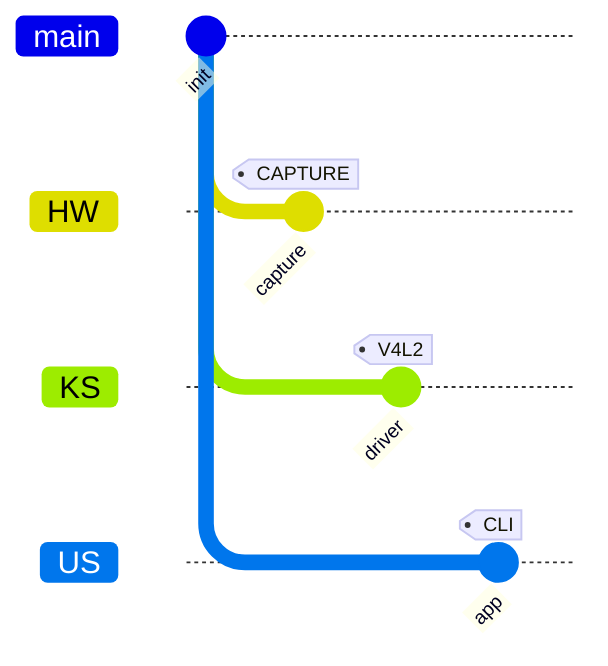

# Git-as-Domain Representation (GADR)

**Version:** 0.102

A minimal, generic specification for using Git concepts (branches, commits, tags) to represent *any complex domain* (software, decision systems, cashflows, hardware, workflows, governance).

---

## 1. Purpose

GADR defines a **static capability lattice** plus **dynamic selection markers** using Git semantics. It is designed for:

* Human readability
* Machine learning ingestion (bitmap / graph)
* Cross-domain neutrality
* Zero dependency on execution order

---

## 2. Core Principles

1. **Existence over execution**
   Git objects represent *what exists*, not *what happens*.

2. **Selection over simulation**
   Behavior is expressed by selecting from a fixed lattice.

3. **Space over time**
   Domains are encoded spatially; time is optional metadata.

4. **Immutability first**
   Once defined, the lattice does not change.

---

## 3. Semantic Mapping

| Git Concept | Domain Meaning                             |
| ----------- | ------------------------------------------ |
| Repository  | Entire domain universe                     |
| Branch      | Orthogonal dimension / layer               |
| Commit      | Atomic capability / state                  |
| Tag         | Activation / selection / flag              |
| Cherry-pick | Scenario traversal                         |
| Merge       | Forbidden (unless domains truly reconcile) |

---

## 4. Branch Specification

### 4.1 Rules

* Each branch represents **one dimension only**
* Branches MUST be independent
* No cross-branch commits

### 4.2 Examples

* Computing: `HW`, `KS`, `US`
* Decision systems: `Signals`, `Rules`, `Outcomes`
* Cashflows: `Assets`, `Flows`, `Constraints`
* Organizations: `People`, `Process`, `Authority`

---

## 5. Commit Specification

### 5.1 Meaning

A commit represents the **existence** of a capability.

* Not execution
* Not ordering
* Not causality

### 5.2 Rules

* Commits MUST be atomic
* Commits SHOULD be immutable
* Commits SHOULD use `REVERSE` or equivalent neutral styling

### 5.3 Naming

Use verb-noun or state identifiers:

* `allocate_buffer`
* `approve_payment`
* `sensor_power_on`

---

## 6. Tag Specification

### 6.1 Meaning

Tags represent **activation**, **selection**, or **observation**.

> Nothing is considered active unless tagged.

### 6.2 Types (Recommended)

Prefix-based namespace:

* `CFG:` configuration
* `CAP:` capability
* `IRQ:` interrupt / event
* `ERR:` failure
* `STEP:` ordered marker

Example:

```
tag: "CFG:Hx08"
tag: "STEP:03"
```

---

## 7. Scenario Modeling

### 7.1 Definition

A scenario is a **path**, not a graph mutation.

### 7.2 Rules

* Scenarios MUST branch from `init`
* Scenarios MAY cherry-pick commits
* Scenarios MUST NOT introduce new commits

### 7.3 Interpretation

The cherry-pick order defines **interpretation order**, not time.

---

## 8. Forbidden Operations

* ❌ Implicit ordering via commit position
* ❌ Merging branches to imply interaction
* ❌ Encoding logic inside commit messages
* ❌ Using Git history as time

---

## 9. Visualization Constraints

* Background lattice MUST be visually muted
* Tags MUST be visually salient
* Branch axes MUST remain fixed

This ensures:

* Human clarity
* CNN-friendly rasterization

---

## 10. Machine Learning Compatibility

### 10.1 Encoding Properties

* Fixed topology
* Sparse activation points
* High signal-to-noise ratio

### 10.2 Learning Task

Seed prediction becomes a **constraint satisfaction problem**, not sequence prediction.

---

## 11. Minimal Compliance Checklist

* [ ] Branches are orthogonal
* [ ] Commits represent existence only
* [ ] Tags represent activation only
* [ ] No merges
* [ ] Scenarios use cherry-pick only

---

## 12. Scope Neutrality

GADR is domain-agnostic. It applies equally to:

* Software systems
* Hardware pipelines
* Financial models
* Organizational governance
* AI reasoning spaces

---

## 13. Process Encoding (Optional Extension)

> "GADR encodes possibility, not process."

When *process* must be represented, GADR introduces **Counters** and a **FLOW / COMM abstraction** without violating the core lattice model.

### 13.1 Counters

Counters are numeric annotations attached to **tags**, not commits.

* Counters represent progression, iteration, or consumption
* Counters MUST NOT alter the capability lattice
* Counters MAY be monotonic or cyclic

Example:

```
tag: "STEP:03@5"   # step 3, counter = 5
```

Counters encode *how many times* or *how far*, never *what exists*.

---

### 13.2 FLOW / COMM Branches

`FLOW` and `COMM` are **domain-agnostic execution pipelines** used only when modeling traversal, signaling, or computation.

| Branch | Meaning                              |
| ------ | ------------------------------------ |
| FLOW   | Traversal, ordering, progression     |
| COMM   | Communication, execution, processing |

Rules:

* FLOW/COMM branches MUST NOT define domain capabilities
* They only host execution markers and counters
* Cherry-picks into FLOW/COMM represent traversal, not creation

---

### 13.3 Cherry-Pick Semantics (Extended)

With FLOW/COMM enabled:

* Cherry-pick into domain branches → capability selection
* Cherry-pick into FLOW/COMM → execution traversal

This preserves the separation between *what is possible* and *what is happening*.

---

## 14. Mermaid Reference Patterns

The following Mermaid examples are **normative supplements** to GADR. They are illustrative, not prescriptive.

### 14.1 Capability Lattice (Static)



---

### 14.2 Scenario as Cherry-Pick Traversal


---

### 14.3 FLOW Traversal with Counters


---

### 14.4 COMM Execution Markers


---

### 14.5 Decision Tree Encoding


---

### 14.6 Cashflow Representation


---

## 15. Versioning

**GADR Version 0.2**

---

## 16. Closing Statement

> GADR encodes **possibility**, not **process**.
>
> Process is layered via FLOW.
> Execution signals via COMM.
> Capability remains immutable.
> Reasoning stays spatial.

---

**End of Spec**
