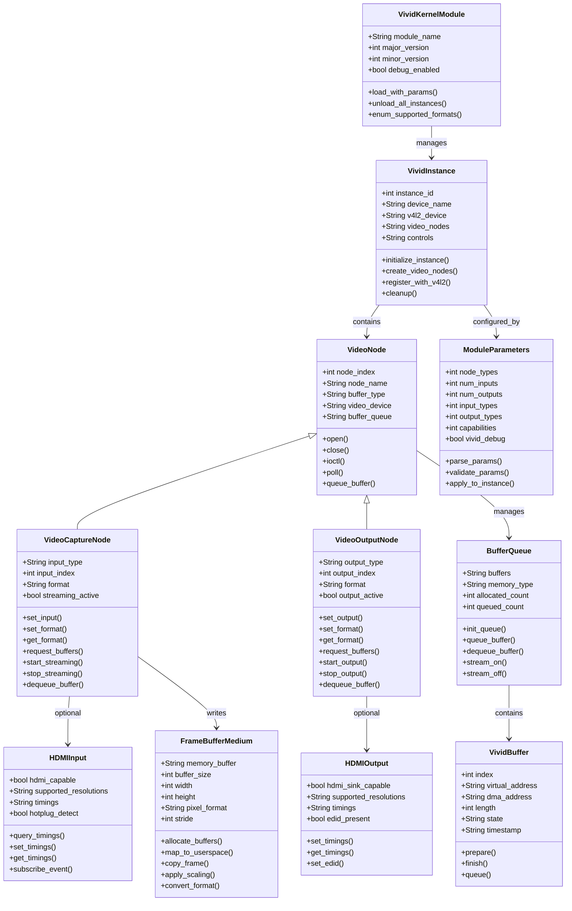
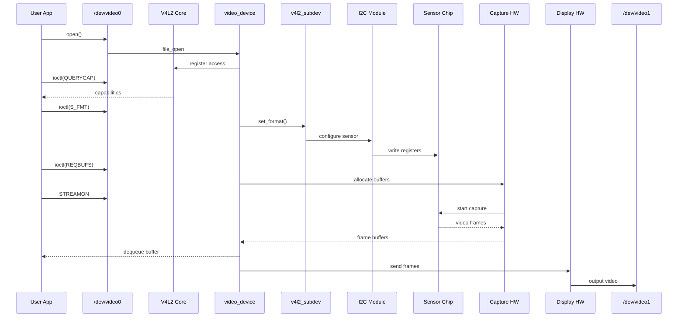
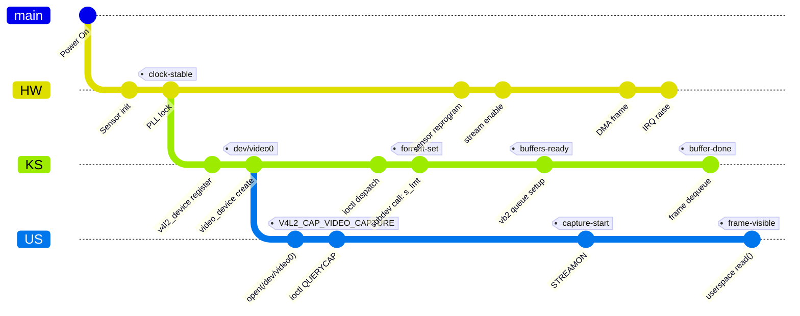
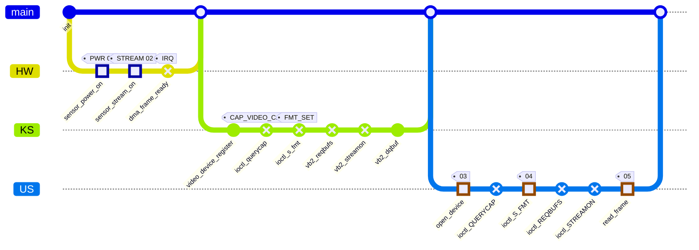

# XSPX 08
  ## Scope: ## Hx⁰⁸ Broadway Framebuffer Multiplier
> The Vivid driver is designed to emulate HDMI outputs virtually and does not require a physical HDMI port. It creates software-based video output devices that behave like real hardware, allowing you to test applications without needing physical display equipment
### What the Vivid Driver Emulates
> The Vivid driver can emulate a full video output device with HDMI outputs in software. Key capabilities include:

> Virtual HDMI Outputs: You can configure an instance of the driver to have multiple video outputs, each defined as an HDMI output type.

> Software-Based Sink: These emulated outputs act as sinks for video data. Your applications can send video streams to these virtual devices as if they were physical displays.

  > Configurable Resolutions: The driver can emulate a wide range of resolutions, including up to 4K.

> Standard Streaming I/O: It supports standard V4L2 streaming methods like write(), MMAP, USERPTR, and DMABUF for output

### ⚙️ How to Configure Virtual HDMI Outputs
You configure the driver's behavior when loading the kernel module vivid.ko. Key options for HDMI output include:

    > node_types: This bitmask option specifies which devices an instance will create. To create a Video Output node, you need to set bit 8.
  
    > output_types: This option defines the type for each output. For an output to be an HDMI output, you need to set its corresponding bit to 1.

    > num_outputs: Specifies how many outputs to create for a video output device (up to 16).

For example, to create a driver instance with just a video output device that has 2 HDMI outputs, you could use module parameters similar to
```bash
# Example - parameters may need adjustment
sudo modprobe vivid node_types=0x100 num_outputs=2 output_types=0x03
```
> The driver provides many other options for fine-tuning, including crop/compose/scale capabilities and memory allocator selection

```bash
# INPUT: Module parameters defining pipeline
sudo modprobe vivid node_types=0x101 num_inputs=1 num_outputs=1 input_types=0x02 output_types=0x02

# PROCESS: Vivid creates...
# 1. Virtual HDMI source (/dev/video0)
# 2. Virtual HDMI sink (/dev/video1)
# 3. Internal frame buffer connection

# OUTPUT: Applications can now...
v4l2-ctl -d /dev/video0 --set-fmt-video=width=1920,height=1080
v4l2-ctl -d /dev/video1 --set-fmt-video=width=1920,height=1080

# Complete the virtual pipeline
ffmpeg -f v4l2 -i /dev/video0 -f v4l2 /dev/video1
```







## Capability definition (static, once)

