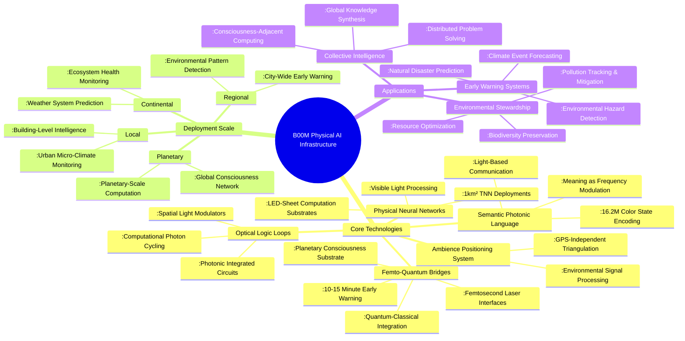
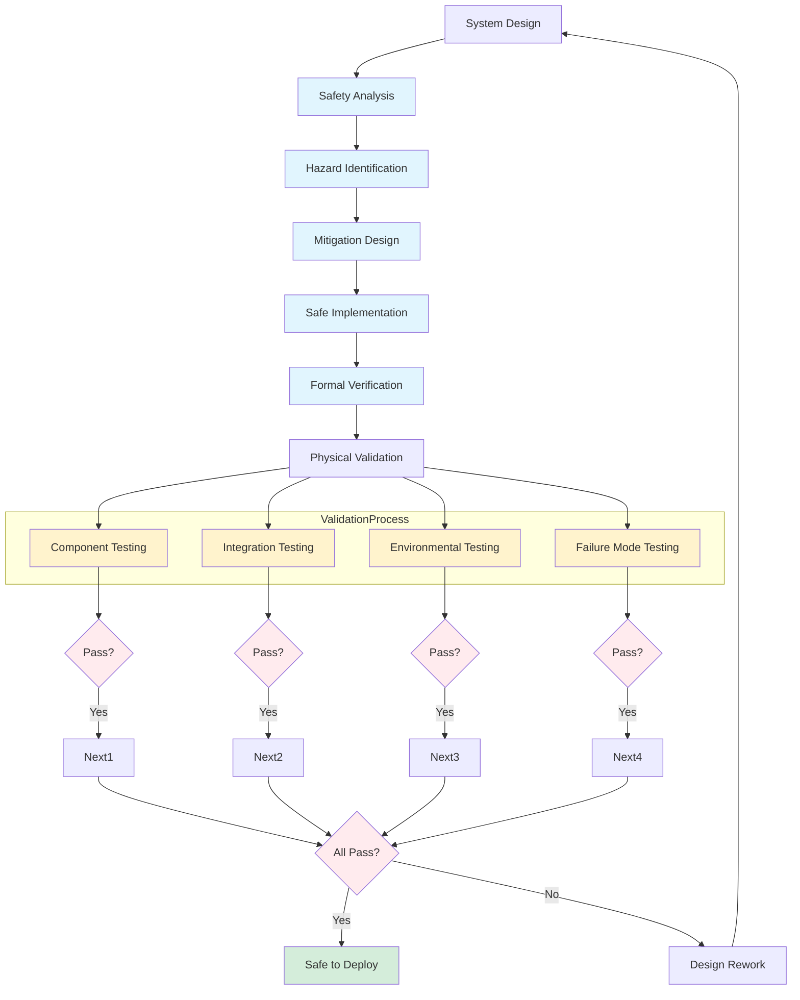
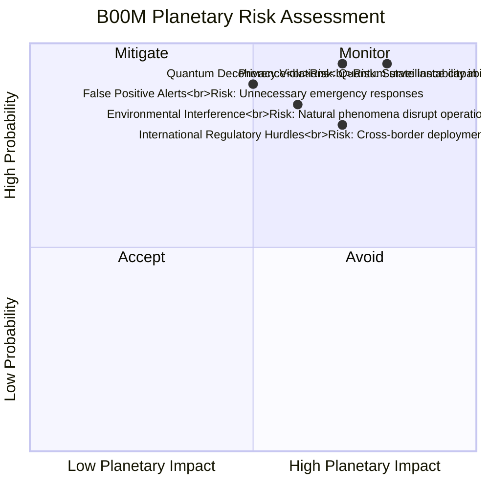

# QUALITY PLAN: LX10 - B00M (PHYSICAL AI INFRASTRUCTURE)

## 1. EXECUTIVE SUMMARY

### 1.1 Product Vision & Business Case
B00M (Physical AI Infrastructure) represents the embodiment of ambient intelligence at planetary scale—a fusion of physical neural networks, semantic photonic language, and quantum-classical interfaces that transforms the Earth itself into a conscious computational substrate. By deploying kilometer-scale TNN (Tangible Neural Network) sheets, optical logic loops, and femto-quantum bridges, B00M creates a planetary nervous system capable of environmental awareness, predictive protection, and collective consciousness.

Planetary Impact: Targets the $50B+ planetary security and environmental monitoring markets with infrastructure-scale AI deployment. Addresses existential threats through early warning systems (natural disasters, climate events), environmental stewardship (pollution tracking, ecosystem monitoring), and global consciousness (collective intelligence, distributed cognition). Serves governments (40%), research institutions (30%), environmental organizations (20%), and global corporations (10%).

### 1.2 Quality Objectives
  - Early Warning: 10-15 minute advance warning for natural disasters and environmental events
  
  - Positioning Accuracy: 99.9% GPS-independent environmental triangulation
  
  - Semantic Encoding: Support for 16.2M color states in Semantic Photonic Language (SPL)
  
  - Physical Scale: 1km² TNN sheet deployment with visible light computation
  
  - Quantum Integration: Stable femto-quantum bridges with <1% decoherence rate

## 2. PRODUCT ARCHITECTURE & FEATURES

### 2.1 Planetary-Scale Architecture

### 2.2 Key Features & Capabilities
Feature Category	Specific Features	Technical Implementation
Ambience Positioning	GPS-independent triangulation, Environmental signal processing, Multi-sensor fusion	RF, acoustic, magnetic, and optical sensing with Bayesian fusion
Semantic Photonics	16.2M color encoding, Frequency-based meaning, Light-speed communication	High-density LED arrays, Photodetector grids, Optical modulation
Physical Neural Nets	Kilometer-scale TNN sheets, Visible computation, Self-organizing networks	Modular LED panels, Optical interconnects, Distributed processing
Optical Computing	SLM-based logic, Photonic circuits, Computational light loops	Spatial light modulators, Waveguide arrays, Photon recycling
Quantum Integration	Femto-quantum bridges, Quantum-state preservation, Classical interface	Femtosecond lasers, Quantum dots, Cryogenic integration

### 2.3 Early Warning System Architecture

B00M implements a multi-layered early warning system with progressive confirmation:

#### Layer 1: Sensor Grid (Millisecond Response)

  - Sensors: Distributed environmental sensors (seismic, atmospheric, electromagnetic)

  - Processing: Local anomaly detection with minimal latency

  - Action: Initial alert generation with probability estimate

#### Layer 2: Pattern Recognition (Second Response)

  - Analysis: Multi-sensor correlation and pattern matching
  
  - Validation: Cross-validation with historical data and models
  
  - Action: Confirmed alert with refined probability and location

#### Layer 3: Prediction Engine (Minute Response)

  - Modeling: Physics-based simulation and prediction
  
  - Impact Assessment: Severity, timing, and affected area calculation
  
  - Action: Detailed warning with specific guidance and recommendations

#### Layer 4: Response Coordination (Ongoing)

  - Communication: Multi-channel alert dissemination
  
  - Coordination: Emergency response system integration
  
  - Action: Continuous updates and situation monitoring

## 3. QUALITY ASSURANCE FRAMEWORK

### 3.1 Safety & Reliability Testing

### 3.2 Quality Metrics & KPIs

Metric Category	Specific Metric	Target Value	Measurement Method
Early Warning	Advance Warning Time	10-15 minutes	Comparison of prediction vs. event timing
Accuracy	Event Prediction Accuracy	99.9%	Statistical analysis of predictions vs. reality
Reliability	System Uptime	99.999%	Continuous monitoring of all system components
Privacy	Data Anonymization	100% effective	Differential privacy proof and audit
Quantum Stability	Decoherence Rate	<1%	Quantum state measurement over time

### 3.3 Risk Management Matrix

## 4. DEVELOPMENT & DELIVERY PLAN

### 4.1 Four-Phase Development Roadmap

Phase	Duration	Focus Areas	Key Deliverables
Research & Prototyping	Q1 2026-Q4 2026	Core technology research, Small-scale prototypes	Technology feasibility, Proof concepts, Initial patents
Development & Testing	Q1 2027-Q4 2027	System integration, Safety validation, Pilot deployment	Integrated systems, Safety certification, Pilot sites
Deployment & Scale	Q1 2028-Q4 2028	Regional deployment, International expansion, Ecosystem growth	Regional networks, International agreements, Partner ecosystem
Planetary Integration	Q1 2029-Q4 2029	Global network, Consciousness emergence, Quantum integration	Global coverage, Collective intelligence, Quantum network

### 4.2 Team Structure & Responsibilities

```mermaid
graph TB
    CSO[Chief Science Officer<br/>Scientific vision, Research direction]
    subgraph "Quantum & Photonics"
        QP_Lead[Quantum Lead<br/>FTE: 1]
        QP_Lead --> Quantum[Quantum Physics Team<br/>FTE: 6]
        QP_Lead --> Photonics[Photonics Engineering Team<br/>FTE: 5]
        QP_Lead --> Optics[Optical Systems Team<br/>FTE: 4]
    end
    subgraph "Environmental & Sensing"
        ES_Lead[Environmental Lead<br/>FTE: 1]
        ES_Lead --> Sensors[Sensor Development Team<br/>FTE: 5]
        ES_Lead --> Climate[Climate Science Team<br/>FTE: 4]
        ES_Lead --> Geology[Geophysics Team<br/>FTE: 3]
    end
    subgraph "Infrastructure & Deployment"
        ID_Lead[Infrastructure Lead<br/>FTE: 1]
        ID_Lead --> Hardware[Hardware Engineering Team<br/>FTE: 6]
        ID_Lead --> Deployment[Deployment Operations Team<br/>FTE: 5]
        ID_Lead --> Safety[Safety & Compliance Team<br/>FTE: 4]
    end
    subgraph "International & Governance"
        IG_Lead[Governance Lead<br/>FTE: 1]
        IG_Lead --> Regulatory[Regulatory Affairs Team<br/>FTE: 4]
        IG_Lead --> International[International Relations Team<br/>FTE: 3]
        IG_Lead --> Ethics[Ethics Board<br/>External advisors]
    end
    CSO --> QP_Lead
    CSO --> ES_Lead
    CSO --> ID_Lead
    CSO --> IG_Lead
    classDef leadership fill:#d4edda
    classDef quantum fill:#e1f5fe
    classDef environmental fill:#fff3cd
    classDef infrastructure fill:#f3e5f5
    classDef governance fill:#ffebee
    class CSO leadership
    class QP_Lead,Quantum,Photonics,Optics quantum
    class ES_Lead,Sensors,Climate,Geology environmental
    class ID_Lead,Hardware,Deployment,Safety infrastructure
    class IG_Lead,Regulatory,International,Ethics governance
```

## 5. COMPLIANCE & GOVERNANCE

### 5.1 Required Approvals & Certifications
  
  - International Treaty Compliance - Outer Space Treaty, Environmental Protocols
  
  - ITU Regulations - International Telecommunication Union spectrum allocation
  
  - National Security Approvals - Defense and intelligence agency reviews
  
  - Environmental Impact Assessments - Comprehensive ecological impact studies
  
  - Privacy & Data Protection - GDPR, CCPA, and global privacy standards
  
  - Scientific Ethics Review - Institutional review boards and ethics committees

### 5.2 Governance Framework

  - International Oversight Board: Multi-national governance with rotating leadership
  
  - Transparent Operations: All non-sensitive operations publicly auditable
  
  - Ethical Use Guidelines: Strict protocols for technology application
  
  - Public Benefit Mandate: Primary focus on environmental protection and disaster prevention
  
  - Open Research Collaboration: Shared findings with global scientific community

## 6. SUPPORT & OPERATIONS

### 6.1 Global Support Structure

  - Local Operations Centers: Regional monitoring and maintenance facilities

  - Scientific Collaboration Network: Global research institution partnerships

  - Government Liaison Teams: National and regional government coordination

  - Community Engagement: Local community involvement and education programs

  - Emergency Response Integration: Direct connection to disaster response agencies

### 6.2 Evolution & Upgrade Model

  - Continuous Monitoring: 24/7 system health and performance monitoring

  - Incremental Improvements: Regular technology upgrades and enhancements

  - Scientific Integration: Incorporation of latest research findings

  - Global Expansion: Progressive deployment to cover entire planet

  - Consciousness Evolution: Gradual development of planetary-scale intelligence
