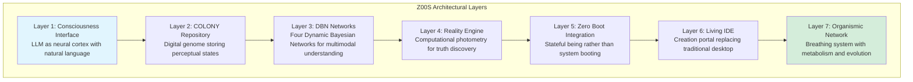
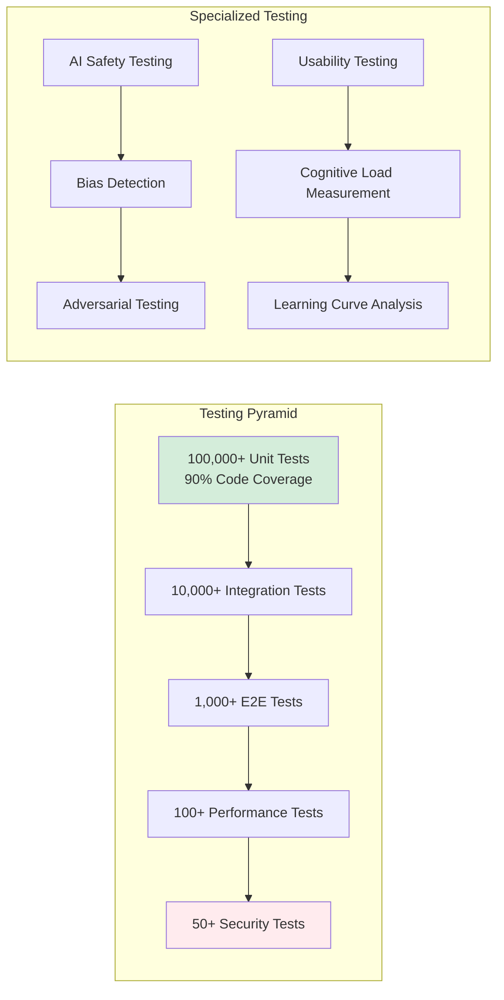
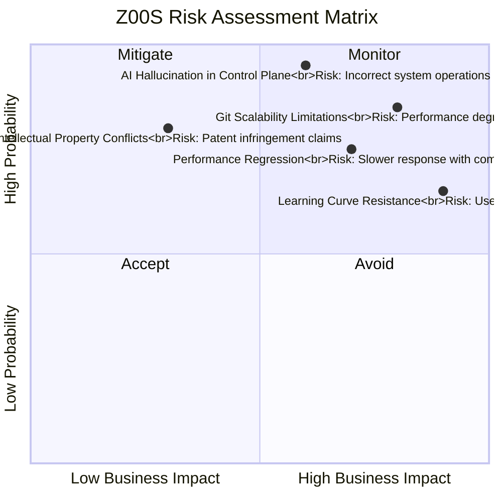
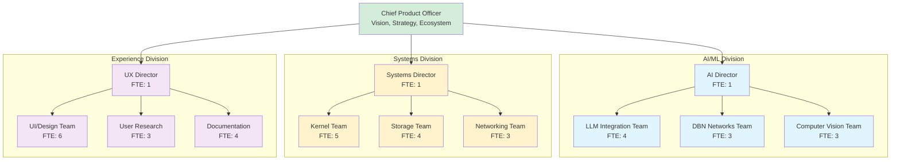

# QUALITY PLAN: LX30 - Z00S (LIVING IDE/OPERATING SYSTEM)

## 1. EXECUTIVE SUMMARY

### 1.1 Product Vision & Business Case
Z00S represents the evolution of computing from tool-based interaction to conscious collaboration. As a Git-native, AI-supervised, self-healing computational substrate, Z00S transforms the IDE from an application into the primary control plane of the entire system. This living operating system understands intent, heals itself, and evolves through use—creating a partnership between human and machine.

Market Disruption: Targets the $300B+ development tools and OS markets by eliminating the separation between development and operation environments. Serves developers, researchers, data scientists, and creative professionals who require seamless integration between ideation, implementation, and deployment.

### 1.2 Quality Objectives
Availability: 99.99% system uptime with autonomous self-healing

Performance: ≤10ms response time for IDE operations, ≤100ms for complex queries

Reliability: Zero data loss with Git-native versioning and automatic backup

Usability: 90% user satisfaction with natural language interface

Learning: System improves 15% monthly through colony-wide learning

## 2. PRODUCT ARCHITECTURE & FEATURES

### 2.1 Seven-Layer Living Stack



### 2.2 Key Features & Capabilities

Feature Category	Specific Features	Technical Implementation
Conscious Interface	Natural language commands, Intent understanding, Context-aware suggestions	GPT-4 integration with custom fine-tuning, Real-time intent parsing
Git-Native Everything	Versioned filesystem, Branch-based experimentation, Automatic rollback	Custom Git implementation with large file support, Real-time sync
Self-Healing System	Automatic anomaly detection, Predictive failure prevention, Colony learning	DBN networks monitoring system state, Automated remediation workflows
Visual Programming	Geometry nodes, Diagramming integration, Real-time collaboration	Blender/Orange3 integration, WebRTC for collaboration, Canvas-based UI
Reality Engine	Light-shadow equilibrium detection, Computational photometry, Truth discovery	GPU-accelerated ray tracing, Photon simulation, Semantic classification

### 2.3 Git Evolution System
Z00S implements an organismic versioning system with specialized branches:

```text
HEAD → Working State (Present Reality)
    ↂ
CHRONICS → Immune Response (Anomaly Quarantine)
    ↂ  
MORPHS → Experimental Evolution (Future Possibilities)
    ↂ
VAX → Verified Stable States (Proven Lineage)
```

User Experience Flow:

```text
User: "Create a 3D visualization of sales data with sunset colors"
     ↓
LLM: Parses intent → identifies components (data, visualization, styling)
     ↓
DBN Networks: Analyzes context → selects optimal tools and parameters
     ↓
Reality Engine: Computes optimal visualization approach
     ↓
System: Executes in virtualized container → presents results
     ↓
Evolution: Successful execution → HEAD commit
           Experimental approach → MORPHS branch
           Error/anomaly → CHRONICS quarantine
```

## 3. QUALITY ASSURANCE FRAMEWORK

### 3.1 Testing Strategy & Coverage


### 3.2 Quality Metrics & KPIs

Metric Category	Specific Metric	Target Value	Measurement Method
System Performance	IDE Response Time	≤10ms	Instrumentation of UI thread operations
AI Accuracy	Intent Understanding	≥95%	Human evaluation of command interpretation
Reliability	Mean Time Between Failures	≥30 days	Production monitoring of system stability
Learning Efficiency	Colony Knowledge Transfer	≥85% success	Cross-instance problem resolution tracking
User Satisfaction	Net Promoter Score	≥50	Quarterly user surveys and feedback

### 3.3 Risk Management Matrix



## 4. DEVELOPMENT & DELIVERY PLAN

### 4.1 Four-Phase Development Roadmap

Phase	Duration	Focus Areas	Key Deliverables
Neural Foundation	Q1-Q4 2026	LLM integration, DBN networks, Basic repository	Natural language interface, COLONY v1, Virtual execution
Perceptual Awakening	Q1-Q4 2027	Reality engine, Multimodal fusion, Zero Boot integration	Computational photometry, Cross-modal understanding, Instant state
Conscious Creation	Q1-Q4 2028	Living IDE, Evolutionary Git, Advanced visualization	Complete creation environment, Self-healing system, Visual tools
Organismic Maturity	Q1-Q4 2029	Colony intelligence, Predictive capabilities, Quantum readiness	Distributed learning, Anticipatory computing, Quantum integration

### 4.2 Team Structure & Responsibilities

## 5. COMPLIANCE & CERTIFICATION

### 5.1 Required Certifications

  - ISO/IEC 27001 - Information security management (2027)
  
  - SOC 2 Type II - Security, availability, processing integrity (2027)
  
  - GDPR/CCPA/DPA Compliance - Global data protection standards (Continuous)
  
  - Accessibility (WCAG 2.1 AA) - Inclusive design compliance (2026)
  
  - AI Ethics Certification - Responsible AI development (2028)

### 5.2 Security & Privacy Framework

  - Data Sovereignty: User data remains under user control with local-first architecture
  
  - Differential Privacy: AI training uses privacy-preserving techniques
  
  - Zero-Knowledge Encryption: End-to-end encryption for all user content
  
  - Transparent AI: All AI decisions are explainable and auditable
  
  - Ethical AI Review Board: External oversight of AI development and deployment

## 6. SUPPORT & MAINTENANCE

### 6.1 Support Tiers

  - Community Tier: Forums, documentation, automated assistance (Free)
  
  - Professional Tier: Email support, 8x5 coverage, 4-hour response ($99/user/month)
  
  - Enterprise Tier: Dedicated support engineer, 24/7 coverage, 1-hour response ($999/user/month)
  
  - Mission Critical: On-site support, custom SLAs, architectural review (Custom pricing)

### 6.2 Update Cadence

  - Daily: Security patches and hotfixes (automated deployment)
  
  - Weekly: Minor improvements and bug fixes
  
  - Monthly: Feature updates and performance enhancements
  
  - Quarterly: Major releases with new capabilities
  
  - Annual: Platform evolution with architectural improvements
