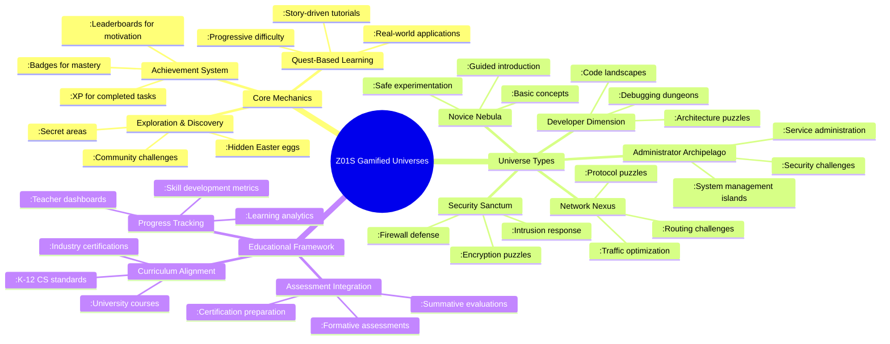
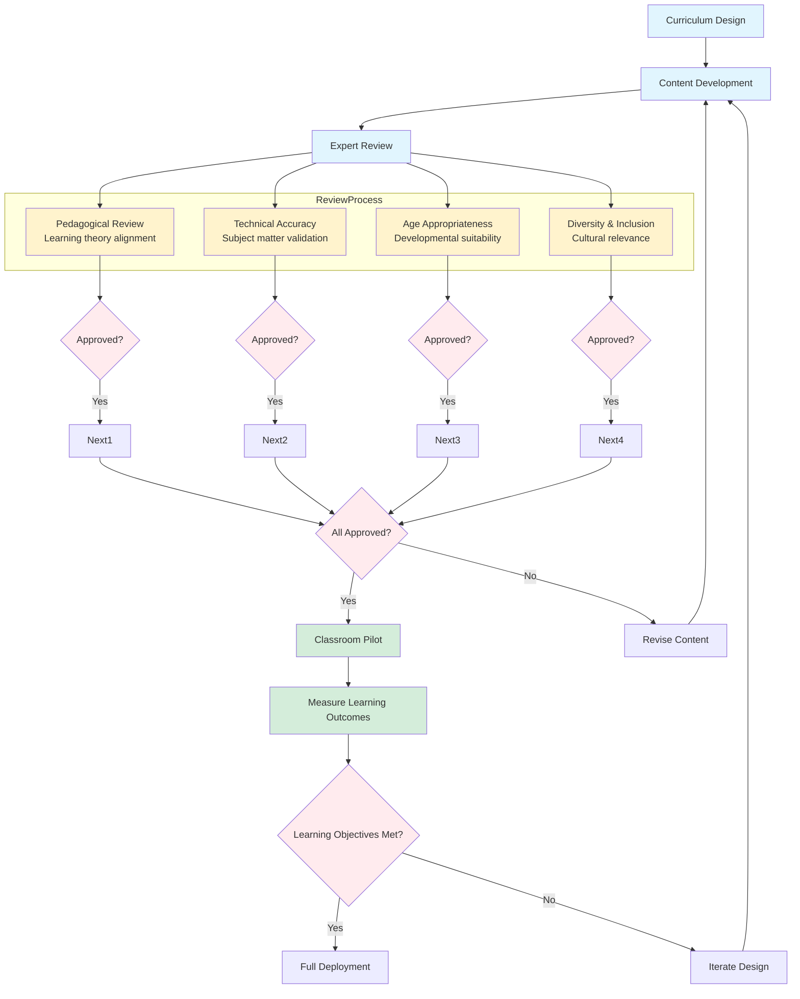
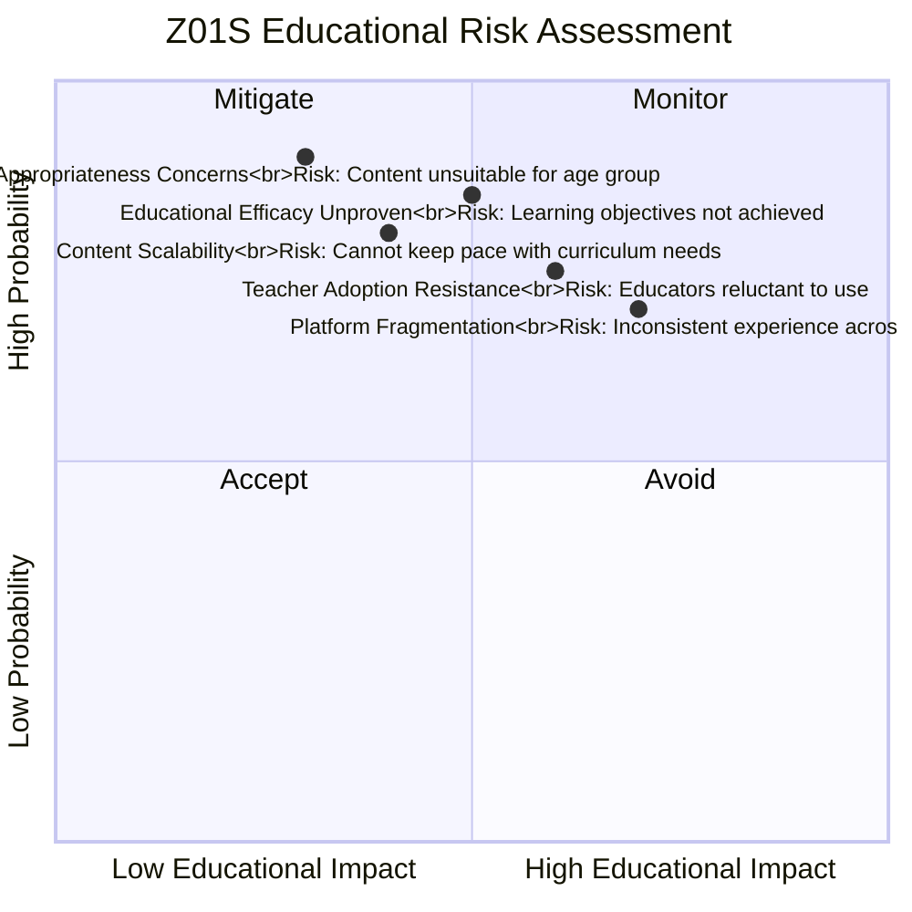
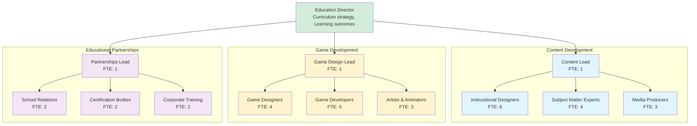

# QUALITY PLAN: LX31 - Z01S (GAMIFIED OPERATING UNIVERSES)

## 1. EXECUTIVE SUMMARY

### 1.1 Product Vision & Business Case

Z01S transforms system administration and software development into an engaging, game-like experience where operating system interactions become quests, administrative tasks become achievements, and learning happens through exploration and play. By gamifying the computing experience, Z01S reduces the learning curve for complex technical concepts while increasing engagement and retention.

Educational Impact: Targets the $7T+ global education market and addresses the critical shortage of technical talent by making complex computing concepts accessible and enjoyable. Serves K-12 education, higher education, vocational training, and lifelong learners seeking to develop technical skills in an engaging environment.

### 1.2 Quality Objectives

  - Learning Efficiency: 80% reduction in time to competency for system administration concepts
  
  - Engagement Metrics: 90% completion rate for tutorial quests, 70% daily active usage
  
  - Knowledge Retention: 70% retention of learned concepts after 6 months
  
  - Accessibility: WCAG 2.1 AA compliance with support for diverse learning styles
  
  - Scalability: Support for 100,000+ concurrent users in classroom deployments

## 2. PRODUCT ARCHITECTURE & FEATURES

### 2.1 Universe Architecture

### 2.2 Key Features & Capabilities

Feature Category	Specific Features	Educational Value
Gamified Interface	Custom POST sequences, Game HUD overlay, Achievement tracking	Reduces intimidation, increases engagement, provides clear progression
Educational Quests	Story-driven tutorials, Real-world scenarios, Progressive challenges	Contextualizes learning, reinforces concepts through application
Skill Development	Skill trees, Mastery levels, Certification preparation	Structured learning path, measurable progress, career alignment
Collaborative Learning	Multiplayer challenges, Team quests, Community competitions	Develops teamwork, enables peer learning, builds community
Teacher Tools	Classroom management, Assignment creation, Progress monitoring	Supports educators, enables differentiated instruction, provides insights

### 2.3 Learning Progression System

Z01S implements a tiered learning system with progressive complexity:

#### Beginner Tier (0-50 hours):

  - Focus: Basic computing concepts, simple commands, safe exploration
  
  - Universe: Novice Nebula with guided tutorials and protected environment
  
  - Outcomes: Comfort with basic system interaction, understanding of fundamental concepts

#### Intermediate Tier (50-200 hours):

  - Focus: System administration, networking basics, introductory programming
  
  - Universes: Administrator Archipelago, Network Nexus, Developer Dimension basics
  
  - Outcomes: Ability to manage systems, troubleshoot issues, write basic scripts

#### Advanced Tier (200-500 hours):

  - Focus: Security, advanced programming, system architecture
  
  - Universes: Security Sanctum, Developer Dimension advanced areas
  
  - Outcomes: Professional-level skills, certification readiness, complex problem-solving

#### Expert Tier (500+ hours):
  
  - Focus: Specialization, optimization, teaching others
  
  - Universes: All areas with expert challenges, community contribution
  
  - Outcomes: Mastery level, ability to design solutions, mentor others

## 3. QUALITY ASSURANCE FRAMEWORK
### 3.1 Educational Efficacy Testing

### 3.2 Quality Metrics & KPIs

Metric Category	Specific Metric	Target Value	Measurement Method
Learning Outcomes	Concept Mastery Rate	≥85%	Pre/post assessment comparisons
Engagement	Daily Active Users	≥70%	Usage analytics and activity tracking
Completion	Quest Completion Rate	≥90%	Progress tracking through learning paths
Retention	6-Month Knowledge Retention	≥70%	Longitudinal assessment of learned concepts
Satisfaction	Student Satisfaction Score	≥4.5/5.0	Regular surveys and feedback collection

### 3.3 Risk Management Matrix

## 4. DEVELOPMENT & DELIVERY PLAN

### 4.1 Three-Phase Development Roadmap

Phase	Duration	Educational Focus	Key Deliverables
Foundation	Q1-Q4 2027	Core gamification engine, Basic curriculum, Teacher tools	Game engine, 100+ hours content, Classroom management
Expansion	Q1-Q4 2028	Advanced topics, Certification prep, Community features	Industry cert alignment, Community platform, Advanced tools
Maturity	Q1-Q4 2029	AI tutoring, AR/VR integration, Global curriculum	Personalized learning, Immersive experiences, Multilingual support

### 4.2 Team Structure & Responsibilities

## 5. COMPLIANCE & CERTIFICATION

### 5.1 Required Certifications
  
  - COPPA Compliance - Children's Online Privacy Protection (Required for K-12)
  
  - FERPA Compliance - Family Educational Rights and Privacy Act (US schools)
  
  - GDPR-K - General Data Protection Regulation for Children (EU)
  
  - WCAG 2.1 AA - Web Content Accessibility Guidelines (Global accessibility)
  
  - ISTE Standards Alignment - International Society for Technology in Education
  
  - Industry Certification Alignment - CompTIA, Cisco, AWS, Microsoft certifications

### 5.2 Privacy & Safety Framework

  - Student Data Protection: No personally identifiable information collection
  
  - Parental Controls: Comprehensive parental oversight and consent management
  
  - Content Filtering: Age-appropriate content with customizable restrictions
  
  - Safe Communication: Moderated communication channels for collaborative learning
  
  - Transparent Reporting: Clear reporting of student progress and activity to educators/parents

## 6. SUPPORT & MAINTENANCE

### 6.1 Educational Support Structure

  - Student Support: In-game tutorials, peer help system, automated assistance
  
  - Teacher Support: Professional development, lesson planning tools, technical assistance
  
  - Administrator Support: Deployment assistance, integration support, reporting tools
  
  - Parent Support: Progress monitoring, activity reports, usage guidance

## 6.2 Content Update Cadence

  - Daily: Bug fixes and technical improvements
  
  - Weekly: New quests and challenges
  
  - Monthly: Curriculum updates and new learning modules
  
  - Quarterly: Major content expansions and feature updates
  
  - Annually: Alignment with updated educational standards and certifications
