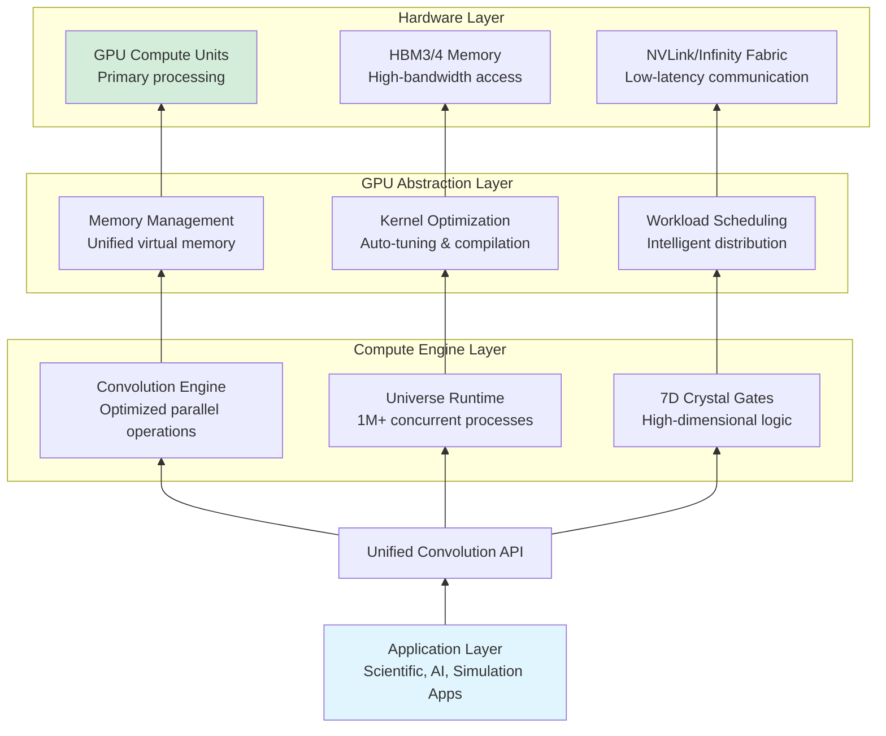
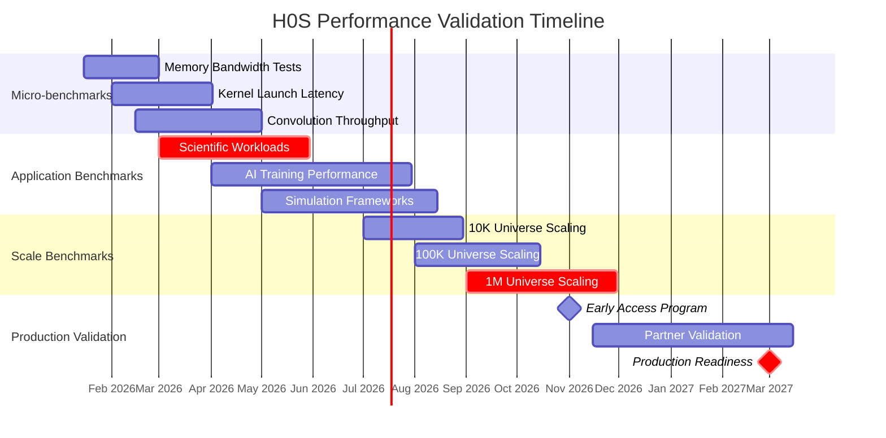
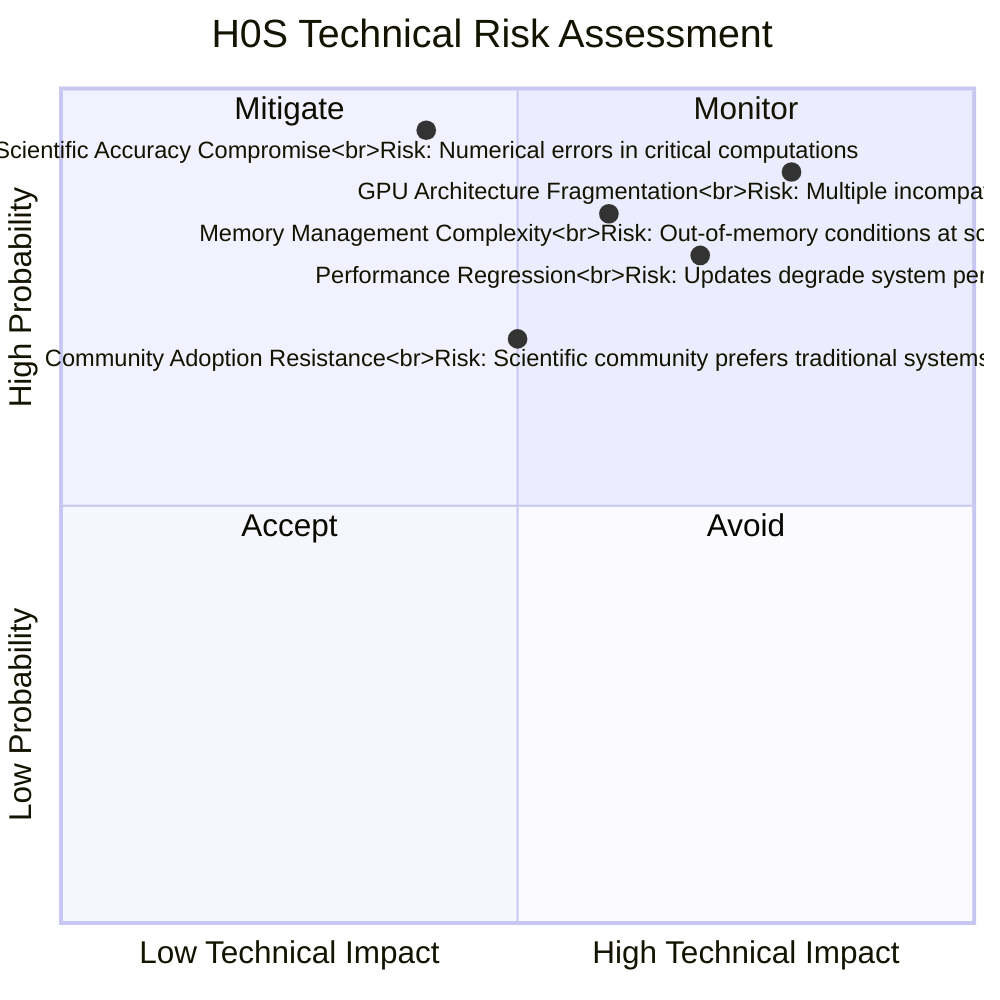
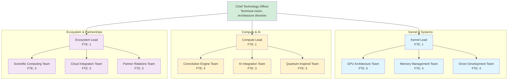

# QUALITY PLAN: LX41 - H0S (HIVE OPERATING SYSTEM)

## 1. EXECUTIVE SUMMARY

### 1.1 Product Vision & Business Case

H0S (Hive Operating System) represents the culmination of GPU-native, convolution-first computing—an operating system designed from the ground up for universe-scale parallel computation. By eliminating CPU-centric bottlenecks and embracing GPU parallelism as the fundamental computational primitive, H0S enables entire computational universes to run as native processes. This living OS learns from every interaction, evolves through colony-wide intelligence, and provides the substrate for consciousness-adjacent computing.

Market Transformation: Targets the $400B+ operating system and cloud infrastructure markets with a complete architectural revolution. Addresses fundamental limitations of von Neumann architectures for AI, scientific computing, and parallel workloads. Serves high-performance computing (22%), AI/ML research (28%), scientific simulation (18%), and next-generation applications (32%).

### 1.2 Quality Objectives

  - Performance: 90% GPU utilization across all system operations, 100x speedup for convolution workloads
  
  - Scalability: Support for 1M+ concurrent computational universes as native processes
  
  - Reliability: 99.99% system availability with autonomous healing and colony synchronization
  
  - Learning: 99.99% colony learning synchronization accuracy across distributed instances
  
  - Compatibility: Binary compatibility with major scientific and AI frameworks through abstraction layer

## 2. PRODUCT ARCHITECTURE & FEATURES

### 2.1 GPU-Native Architecture Stack



### 2.2 Key Features & Capabilities

Feature Category	Specific Features	Technical Implementation
GPU-Native Design	GPU as primary processor, CPU elimination where possible, Unified memory architecture	CUDA/HIP/OpenCL abstraction, GPU-driven scheduling, Zero-copy memory
Convolution-First	All operations as convolution primitives, Automatic kernel optimization, Tensor-aware scheduling	Deep learning compiler integration, Auto-tuning for hardware, Tensor core utilization
Universe Execution	Parallel universe support, Cross-universe communication, Shared resource management	Lightweight process isolation, Efficient context switching, Inter-universe messaging
Colony Learning	Distributed intelligence, Collective optimization, Experience sharing	Federated learning algorithms, Delta synchronization, Consensus-based updates
7D Crystal Gates	High-dimensional logic, Non-binary computation, Quantum-inspired operations	Geometric algebra implementation, Multi-valued logic gates, Topological computing

### 2.3 Colony Intelligence System

H0S implements a distributed learning system where every instance contributes to and benefits from collective intelligence:

#### Learning Cycle:

```text
Local Experience → Pattern Extraction → Delta Generation
       ↓                    ↓                  ↓
Individual Use     Local Optimization    Change Proposal
       ↓                    ↓                  ↓
Colony Sync → Consensus Validation → Global Integration
```

#### Knowledge Propagation:

  - Immediate: Critical security patches and fixes (within minutes)
  
  - Rapid: Performance optimizations and bug fixes (within hours)
  
  - Standard: Feature updates and improvements (within days)
  
  - Evolutionary: Architectural changes and major enhancements (within weeks)

## 3. QUALITY ASSURANCE FRAMEWORK

### 3.1 Performance Benchmarking Suite



### 3.2 Quality Metrics & KPIs

Metric Category	Specific Metric	Target Value	Measurement Method
GPU Utilization	Average GPU Usage	≥90%	Hardware performance counters
Performance	Convolution Speedup	100x vs traditional OS	Standard benchmark suite comparison
Scalability	Concurrent Universes	1M+	Stress testing with synthetic loads
Reliability	System Uptime	99.99%	Continuous monitoring of production systems
Learning Efficiency	Colony Sync Accuracy	99.99%	Validation of distributed state consistency

### 3.3 Risk Management Matrix



### 4. DEVELOPMENT & DELIVERY PLAN
#### 4.1 Three-Phase Development Roadmap

Phase	Duration	Technical Focus	Key Deliverables
Core Architecture	Q1 2026-Q1 2027	GPU-native kernel, Convolution engine, Basic runtime	H0S Kernel v1.0, Convolution API, Universe runtime
Advanced Features	Q2 2027-Q4 2027	Colony learning, 7D crystal gates, Scientific libraries	Colony intelligence, High-dimensional logic, Math libraries
Ecosystem Maturity	Q1 2028-Q4 2028	Partner integration, Cloud deployment, Global colony	Partner certifications, Cloud offering, Global network

#### 4.2 Team Structure & Responsibilities



## 5. COMPLIANCE & CERTIFICATION

### 5.1 Required Certifications

  - ISO/IEC 27001 - Information security management systems
  
  - SOC 2 Type II - Security, availability, processing integrity
  
  - NIST SP 800-53 - Security and privacy controls (for government use)
  
  - HIPAA Compliance - Healthcare data protection (for medical research)
  
  - GDPR/CCPA Compliance - Data protection and privacy
  
  - Scientific Validation - Reproducibility certification for research use

### 5.2 Security & Integrity Framework

  - Formal Verification: Critical kernel components mathematically proven correct
   
  - Memory Safety: Rust-based implementation with zero undefined behavior
  
  - Quantum Resistance: Post-quantum cryptography for all security primitives
  
  - Tamper Evidence: Cryptographic proof of system integrity
  
  - Transparent Updates: All changes cryptographically signed and publicly auditable

## 6. SUPPORT & MAINTENANCE

### 6.1 Support Tiers

  - Community Tier: Forums, documentation, community support (Free)
  
  - Research Tier: Technical support, bug fixes, academic licensing (Institutional pricing)
  
  - Enterprise Tier: 24/7 support, SLA guarantees, custom development (Commercial pricing)
  
  - Mission Critical: On-site support, custom SLAs, architectural review (Custom pricing)

### 6.2 Update Model

  - Continuous Security: Immediate patches for critical vulnerabilities
  
  - Weekly Performance: Regular performance optimizations and improvements
  
  - Monthly Features: New capabilities and enhancements
  
  - Quarterly Major: Significant updates with new architectural features
  
  - Annual Evolution: Major releases with breakthrough capabilities
