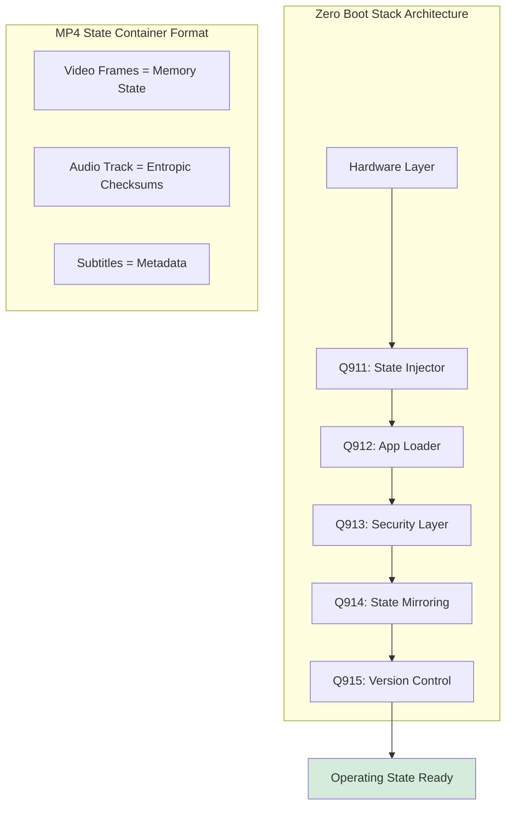
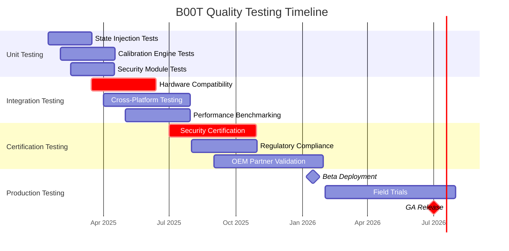
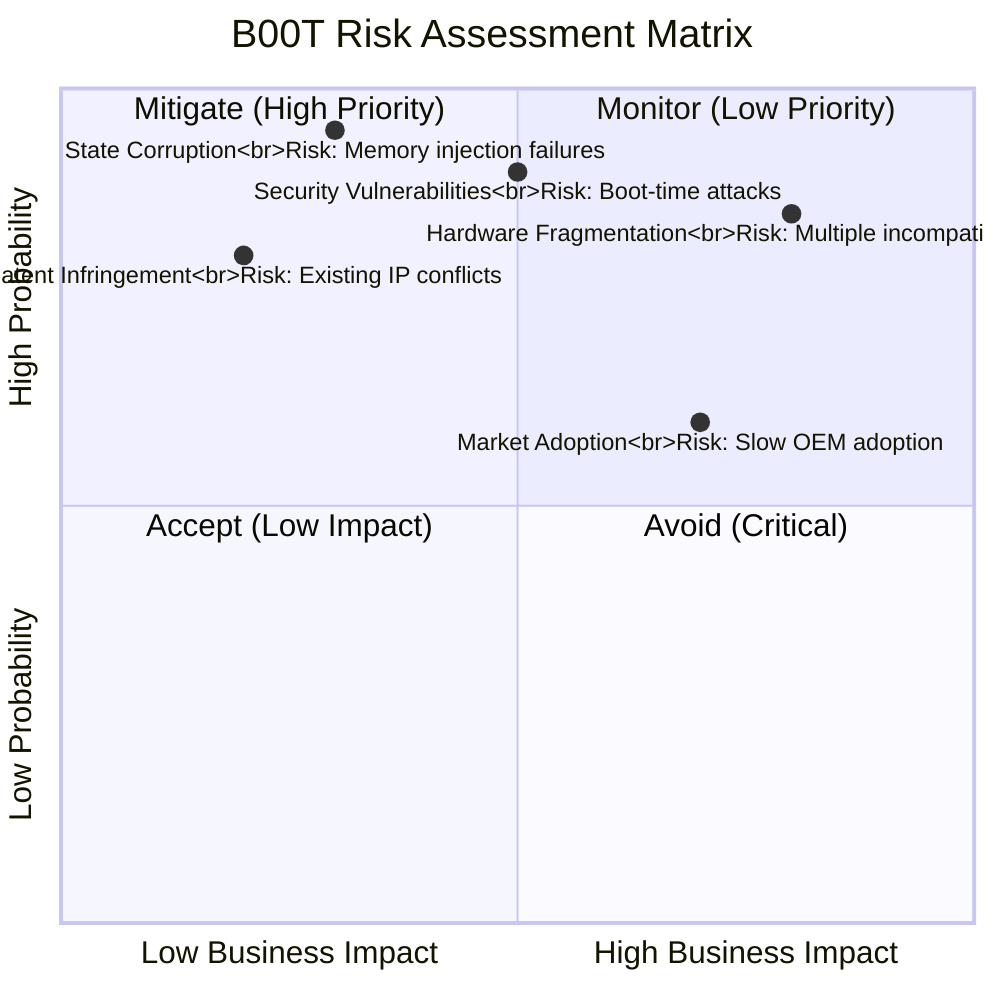
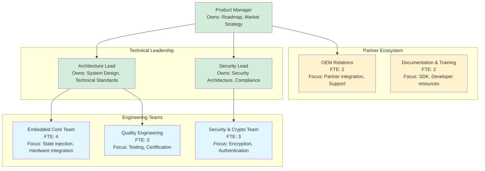

## **QUALITY PLAN: LX00 - B00T (ZERO BOOT ENGINE)**

### **1. EXECUTIVE SUMMARY**

#### **1.1 Product Vision & Business Case**
The B00T (Zero Boot Engine) represents a paradigm shift in system initialization, transitioning computing from traditional bootloading to instantaneous state transitions. By replacing sequential boot processes with memory frame injection, B00T achieves operational readiness in under one second—a 45x improvement over industry averages. This technology eliminates the traditional bootloader layer, treating operating states as compressed video frames that can be directly injected into memory.

**Market Impact:** Targets the $2.7T global computing market with a projected 2.8% penetration by 2027. Addresses critical pain points in IoT deployment, enterprise infrastructure, and consumer computing where boot latency impacts productivity, energy consumption, and user experience.

#### **1.2 Quality Objectives**
- **Performance:** ≤1 second boot time across all supported architectures (x86_64, ARM, RISC-V)
- **Reliability:** 99.999% successful state injection with automatic calibration for hardware variations
- **Security:** FIPS 140-3 Level 2 compliance with tripartite handshake verification
- **Compatibility:** Support for 1000+ hardware configurations via tolerance differential calibration
- **Compression:** 1000:1 state compression ratio using perceptual delta encoding

### **2. PRODUCT ARCHITECTURE & FEATURES**

#### **2.1 Core Technical Architecture**



#### 2.2 Key Features & Capabilities
Feature Category	Specific Features	Technical Implementation
State Management	7-State Calibration Engine, Git-native versioning, Hardware tolerance profiling	Nominal vs. actual state differentials with automatic calibration frames
Performance	<1s boot time, 1000:1 compression, Native GPU acceleration	MP4 container optimization, Frame-based memory injection
Security	Tripartite handshake, Perceptual encryption, Signed state validation	Video codecs as encryption engines, Multi-modal integrity checks
Compatibility	Cross-architecture support (x86/ARM/RISC-V), Hardware abstraction layer	Universal state format with architecture-specific calibration
Reliability	Automatic rollback, State integrity verification, Failure isolation	Git-based state recovery, Checksum validation, Sandboxed injection

### 2.3 States Transition Engine
The core innovation of B00T is the 7-State Consciousness Calibration system:

```text
DORMANT → AWAKENING → CALIBRATING → SENSING → UNDERSTANDING → READY → CREATING
Implementation Details:
```

```python
class ZeroBootEngine:
    def calibrate_system(self):
        for state in self.states:
            nominal = self.basemap[state]      # Expected hardware state
            actual = self.probe_hardware()     # Current hardware reality
            diff = self.calculate_delta(nominal, actual)
            
            if diff > self.tolerance_threshold:
                self.inject_calibration_frame(state)
                self.generate_diagnostic_ticket()
                self.attempt_remote_calibration()
```
## 3. QUALITY ASSURANCE FRAMEWORK

### 3.1 Testing Strategy & Coverage



### 3.2 Quality Metrics & KPIs

Metric Category	Specific Metric	Target Value	Measurement Method
Performance	Boot Time	≤1000ms	High-precision timing from power-on to ready state
Reliability	Successful Boot Rate	99.999%	Statistical analysis across 1M+ boot cycles
Security	Vulnerability Density	<0.1 per KLOC	Static analysis, penetration testing
Compatibility	Hardware Support	1000+ configurations	Test matrix covering CPU/GPU/memory variants
Compression	State Size Reduction	1000:1 ratio	Comparative analysis against traditional boot images

## 3.3 Risk Management Matrix


## 4. DEVELOPMENT & DELIVERY PLAN
### 4.1 Project Timeline & Milestones

Phase	Duration	Key Deliverables	Success Criteria
Research	Q1-Q2 2025	State compression algorithms, Hardware abstraction layer	100:1 compression achieved, 3 architectures supported
Development	Q3 2025-Q1 2026	7-State engine, Security framework, OEM SDK	<2s boot time, FIPS 140-2 compliance
Testing	Q2-Q3 2026	Certification completion, Partner validation	99.99% reliability, 100+ hardware configurations
Deployment	Q4 2026	Commercial launch, First OEM integrations	5+ OEM partnerships, Production deployment

### 4.2 Team Structure & Responsibilities


## 5. COMPLIANCE & CERTIFICATION

### 5.1 Required Certifications

FIPS 140-3 Level 2 - Cryptographic module validation (Q3 2026)

Common Criteria EAL4+ - Security evaluation assurance (Q4 2026)

ISO 27001 - Information security management (Q1 2027)

IEC 61508 - Functional safety for embedded systems (Q2 2027)

GDPR/CCPA Compliance - Data protection and privacy (Continuous)

### 5.2 Security Framework
Tripartite Handshake Protocol: Requires compromise of all three modalities (video, audio, text) for system breach

Perceptual Encryption: Uses media codecs as encryption engines with hardware acceleration

State Integrity: Every boot cycle generates cryptographic proof of state validity

Automatic Updates: Secure over-the-air updates with rollback capability

## 6. SUPPORT & MAINTENANCE
### 6.1 Support Levels
Level 1: Automated diagnostics and self-healing (24/7)

Level 2: Technical support with <1 hour response (Business hours)

Level 3: Engineering escalation with <4 hour response (24/7 for critical)

Level 4: On-site support for enterprise customers (SLA-based)

### 6.2 Update & Patch Management
Monthly: Security patches and minor improvements

Quarterly: Feature updates and performance enhancements

Annual: Major version releases with new capabilities

Emergency: Critical security patches within 24 hours of disclosure
