This template provides comprehensive visual documentation with 15 different Mermaid diagram types:

01. [ ] Flowcharts for processes
02. [ ] Gantt charts for timelines
03. [ ] Mind maps for scope
04. [ ] Organizational charts
05. [ ] Quadrant charts for risk assessment
06. [ ] Pie charts for distributions
07. [ ] Sequence diagrams for workflows
08. [ ] Timelines for milestones
09. [ ] Relationship graphs
10. [ ] Escalation paths
11. [ ] PDCA cycles
12. [ ] Approval workflows
13. [ ] Stakeholder matrices
14. [ ] Revision histories
15. [ ] Authority matrices

# Quality Plan: [Project Name]

## 1. Project Overview
- **Project Name:** [Project Name]
- **Project ID:** [Project ID]
- **Product Category:** [Product Category]
- **Target Market:** [Primary Market Segments]
- **Project Phase:** [Conceptual/Research/Active Development/Deployment]
- **Quality Assurance Level:** [Low/Medium/High/Critical]

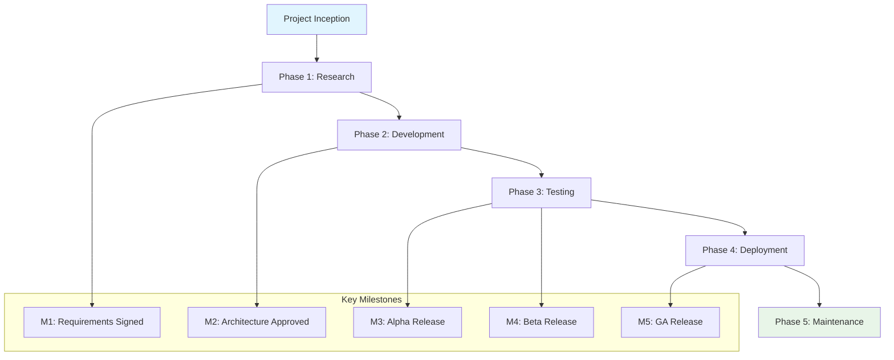
## 2. Objectives & KPIs
Primary Objective: [Brief description of main objective]

Success Metrics:

[Metric 1]: [Target Value]

[Metric 2]: [Target Value]

[Metric 3]: [Target Value]

Business Objectives:

[Business Objective 1]

[Business Objective 2]

[Business Objective 3]

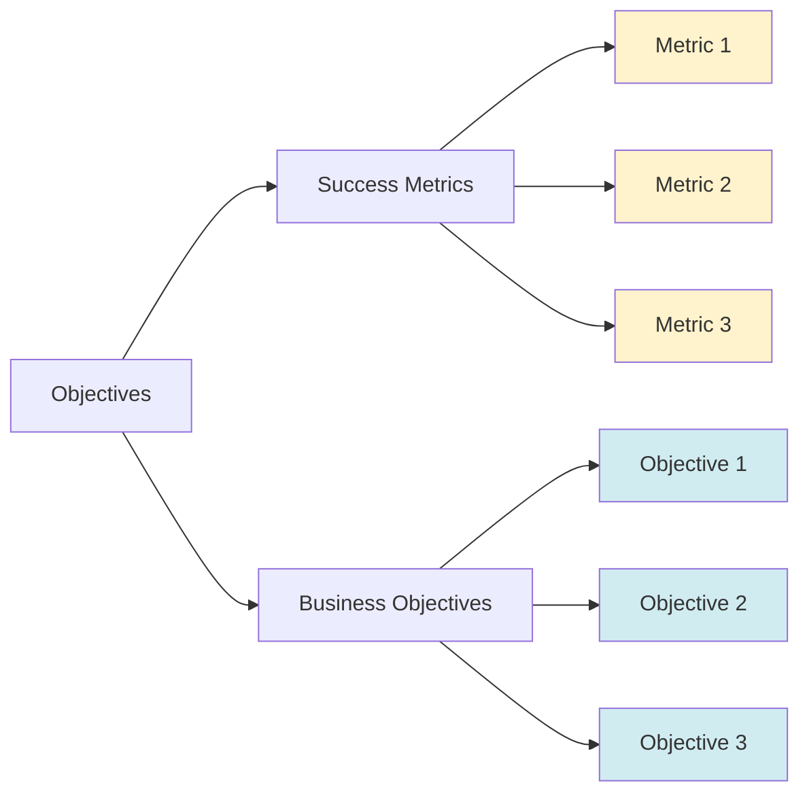

## 3. Scope & Boundaries

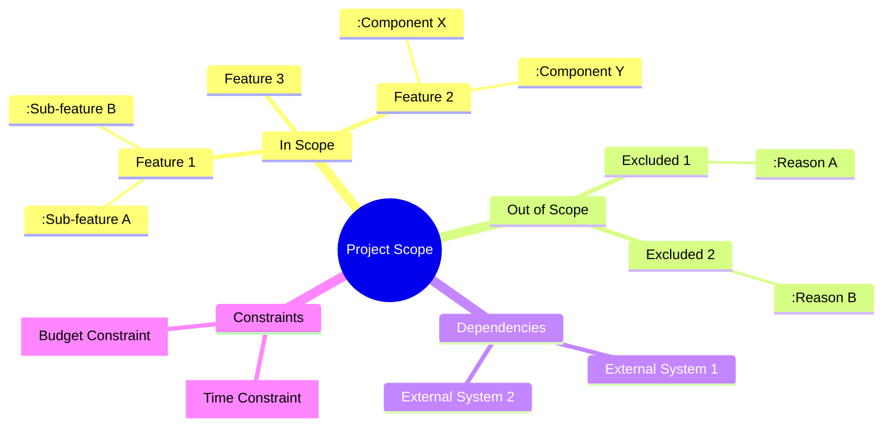

## 4. Deliverables Timeline

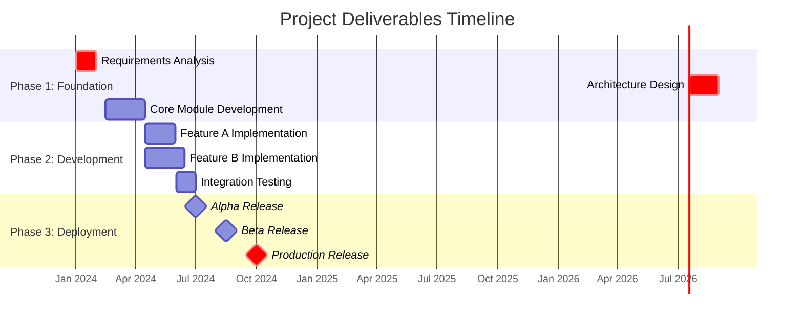

## 5. Resource Allocation & Team Structure

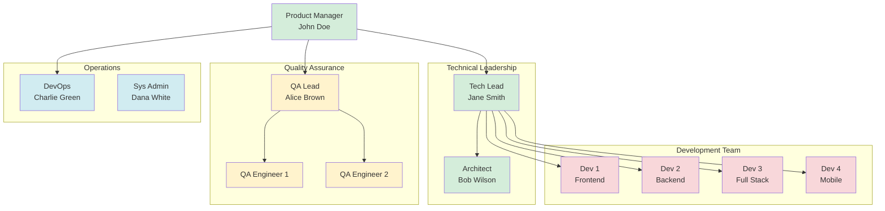

Role	FTEs	Key Responsibilities

---

[Role 1]	[Number]	[Responsibilities]

---
[Role 2]	[Number]	[Responsibilities
[Role 3]	[Number]	[Responsibilities]
[Role 4]	[Number]	[Responsibilities]
[Role 5]	[Number]	[Responsibilities]

## 6. Risk Management Matrix

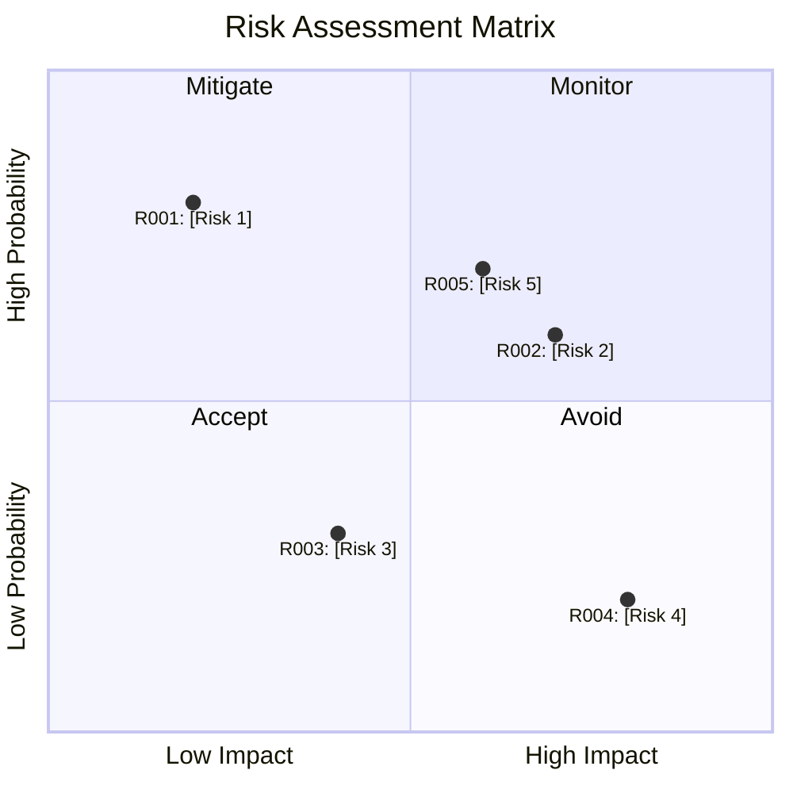
Risk ID	Risk Description	Probability	Impact	Mitigation Strategy

R001	[Risk Description]	[Low/Medium/High]	[Low/Medium/High]	[Mitigation Strategy]

---

R002	[Risk Description]	[Low/Medium/High]	[Low/Medium/High]	[Mitigation Strategy]

---

R003	[Risk Description]	[Low/Medium/High]	[Low/Medium/High]	[Mitigation Strategy]

---

R004	[Risk Description]	[Low/Medium/High]	[Low/Medium/High]	[Mitigation Strategy]

---

R005	[Risk Description]	[Low/Medium/High]	[Low/Medium/High]	[Mitigation Strategy]

---


## 7. Quality Assurance Workflow
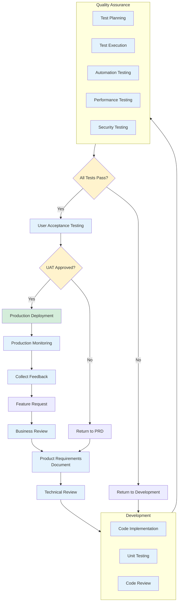


## 8. Testing Strategy & Coverage

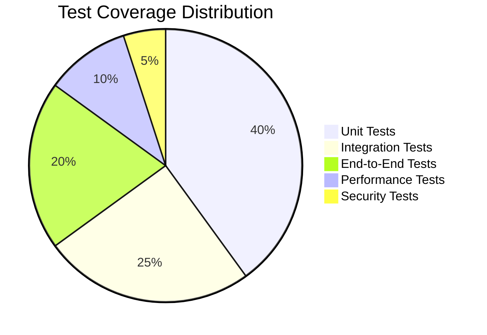
## Testing Strategy:

Unit Test Coverage: [Target Percentage]%

Integration Testing: [Frequency] automated regression

Performance Testing: [Frequency] benchmark cycles

Security Testing: [Frequency] penetration tests

Compliance Testing: [Frequency] audit cycles

## Quality Gates:
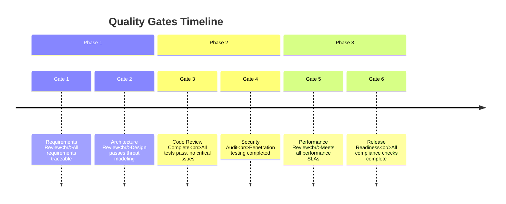

### 9. Change Management Process
```mermaid
sequenceDiagram
    participant R as Requester
    participant CCB as Change Control Board
    participant Dev as Development Team
    participant QA as QA Team
    participant OPS as Operations
    R->>CCB: Submit Change Request
    CCB->>CCB: Review & Categorize
    alt Critical Change
        CCB->>Dev: Emergency Review (24hr)
        Dev->>QA: Immediate Testing
        QA->>OPS: Expedited Deployment
    else Major Change
        CCB->>Dev: Standard Review (72hr)
        Dev->>QA: Scheduled Testing
        QA->>OPS: Planned Deployment
    else Minor Change
        CCB->>Dev: Weekly Batch Review
        Dev->>QA: Regression Testing
        QA->>OPS: Regular Deployment
    end
    OPS->>R: Change Implemented
    R->>CCB: Confirm Completion
10. Communication & Stakeholder Matrix
graph LR
    subgraph "Stakeholder Groups"
        SG1[Executive Team]
        SG2[Product Team]
        SG3[Development Team]
        SG4[QA Team]
        SG5[Operations]
        SG6[Clients/Users]
    end
    subgraph "Communication Channels"
        C1[Weekly Status Reports]
        C2[Daily Standups]
        C3[Sprint Reviews]
        C4[Monthly Business Reviews]
        C5[Incident Alerts]
        C6[Release Notes]
    end
    SG1 -.-> C4
    SG2 -.-> C1
    SG2 -.-> C3
    SG3 -.-> C2
    SG4 -.-> C2
    SG5 -.-> C5
    SG6 -.-> C6
    classDef stakeholder fill:#e1f5fe
    classDef channel fill:#f3e5f5
    class SG1,SG2,SG3,SG4,SG5,SG6 stakeholder
    class C1,C2,C3,C4,C5,C6 channel
```

## 11. Compliance & Certification Roadmap

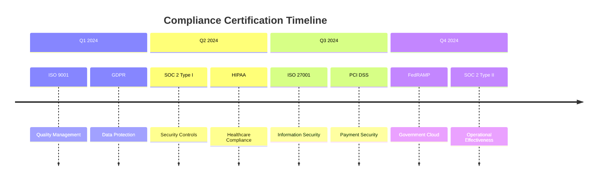

## 12. Performance Metrics Dashboard

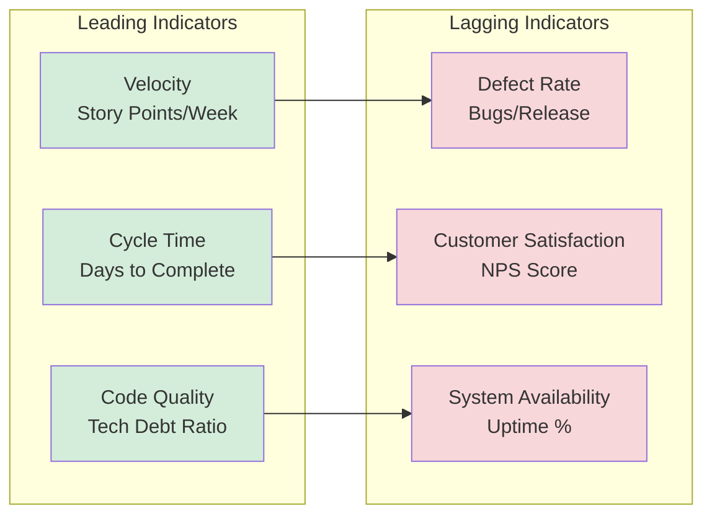

# 13. Escalation Path

```mermaid
graph TD
    Level1[Level 1<br/>Team Member]
    Level2[Level 2<br/>Team Lead]
    Level3[Level 3<br/>Department Head]
    Level4[Level 4<br/>Executive Committee]
    Level1 -->|Unresolved in 24h| Level2
    Level2 -->|Unresolved in 48h| Level3
    Level3 -->|Unresolved in 72h| Level4
    Level4 -->|Critical Issue| Emergency[Emergency Response<br/>Team]
    classDef level1 fill:#d4edda
    classDef level2 fill:#fff3cd
    classDef level3 fill:#f8d7da
    classDef level4 fill:#d1ecf1
    classDef emergency fill:#f5c6cb
    class Level1 level1
    class Level2 level2
    class Level3 level3
    class Level4 level4
    class Emergency emergency

## 14. Continuous Improvement Cycle

```mermaid
flowchart LR
    Plan[Plan<br/>Define objectives<br/>and processes]
    Do[Do<br/>Implement<br/>processes]
    Check[Check<br/>Monitor results<br/>against objectives]
    Act[Act<br/>Take corrective<br/>actions]
    
    Plan --> Do
    Do --> Check
    Check --> Act
    Act --> Plan
    
    classDef phase fill:#e3f2fd,stroke:#1565c0
    class Plan,Do,Check,Act phase
```
## 15. Approval Workflow
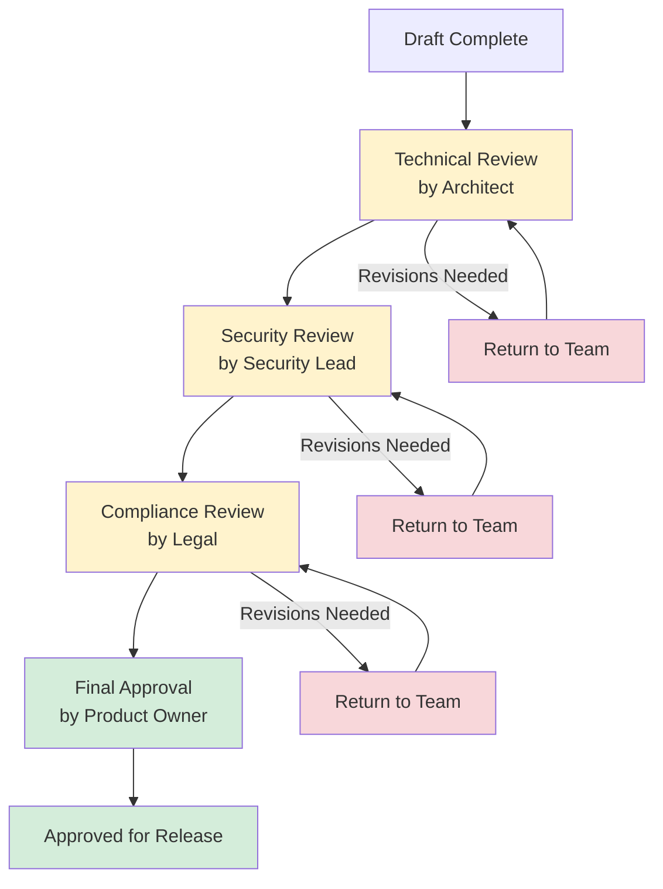
Revision History
gantt
    title Document Revision History
    dateFormat  YYYY-MM-DD
    axisFormat  %b %d
    
    section Revisions
    Version 1.0 (Initial)    :done, 2024-01-15, 1d
    Version 1.1 (Updates)    :done, 2024-02-01, 1d
    Version 1.2 (Tech Review):done, 2024-02-15, 1d
    Version 2.0 (Final)      :milestone, 2024-03-01, 0d
    Version 2.1 (Post-Launch):active, 2024-04-01, 1d
Version	Date	Author	Changes
1.0	[Date]	[Name]	Initial creation
[Version]	[Date]	[Name]	[Description of changes]
Sign-off Authority Matrix
graph TD
    subgraph "Approval Authorities"
        PM[Product Manager]
        TL[Technical Lead]
        Sec[Security Officer]
        Legal[Legal Counsel]
        Exec[Executive Sponsor]
    end
    
    subgraph "Document Sections"
        S1[Requirements]
        S2[Architecture]
        S3[Security]
        S4[Compliance]
        S5[Budget]
    end
    
    PM --> S1
    TL --> S2
    Sec --> S3
    Legal --> S4
    Exec --> S5
    
    classDef authority fill:#d4edda
    classDef section fill:#e1f5fe
    
    class PM,TL,Sec,Legal,Exec authority
    class S1,S2,S3,S4,S5 section
Final Approval
timeline
    title Final Approval Sequence
    section Approval Flow
        Technical Lead : Reviews technical feasibility
        Quality Manager : Validates testing approach
        Security Officer : Approves security measures
        Product Owner : Business sign-off
        Executive Sponsor : Final authorization
