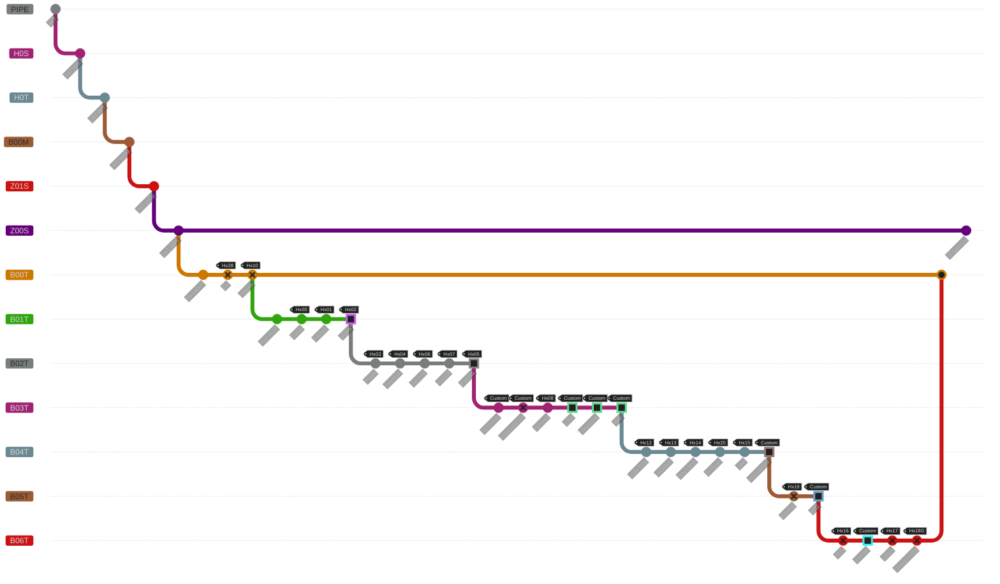

<!-- ANCHOR: D401 -->

```mermaid
%%{init: { 'logLevel': 'debug', 'theme': 'dark', 'gitGraph': {'showBranches': true, 'showCommitLabel': true, 'mainBranchName': 'PIPE'} } }%%
gitGraph  
    commit id: "INIT"
    branch H0S
    commit id: "INIT H0S"
    branch H0T
    commit id: "INIT H0T"
    branch B00M
    checkout B00M
    commit id: "INIT B00M"
    branch Z01S
    checkout Z01S
    commit id: "INIT Z01S"
    branch Z00S
    checkout Z00S
    commit id: "INIT Z00S"
    branch B00T
    checkout B00T
    commit id: "INIT B00T"
    commit id: "Git" tag: "Hx28" type: REVERSE
    commit id: "Natives" tag: "Hx10" type: REVERSE
    branch B01T
    checkout B01T
    commit id: "INIT B01T"
    commit id: "Pixels" tag:"Hx00"
    commit id: "Frames" tag:"Hx01"
    commit id: "States" tag:"Hx02" type: HIGHLIGHT
    branch B02T
    checkout B02T
    commit id: "Triplet" tag:"Hx03"
    commit id: "Structure" tag:"Hx04"
    commit id: "Security" tag:"Hx06"
    commit id: "Control" tag: "Hx07"
    commit id: "Process" tag:"Hx05" type: HIGHLIGHT
    branch B03T
    checkout B03T
    commit id: "RESProto" tag: "Custom"
    commit id: "DragonFly Git" tag: "Custom" type: REVERSE
    commit id: "Torrents" tag:"Hx08"
    commit id: "Chat" tag: "Custom" type: HIGHLIGHT
    commit id: "Streaming" tag: "Custom" type:  HIGHLIGHT
    commit id: "Web" tag: "Custom" type: HIGHLIGHT
    branch B04T
    checkout B04T
    commit id: "Data Prog" tag: "Hx12"
    commit id: "WebMod" tag: "Hx13"
    commit id: "RayTracer" tag: "Hx14"
    commit id: "BiTracer" tag: "Hx20"
    commit id: "LBR" tag:"Hx15"
    commit id: "MarketPlace" tag:"Custom" type: HIGHLIGHT
    branch B05T
    checkout B05T
    commit id: "Gaming" tag:"Hx19" type: REVERSE
    commit id: "0111" tag:"Custom" type: HIGHLIGHT
    branch B06T
    checkout B06T
    commit id: "APS" tag:"Hx16" type: REVERSE
    commit id: "ASleuth" tag: "Custom" type: HIGHLIGHT 
    commit id: "ABBA" tag: "Hx17" type: REVERSE
    commit id: "Global UCRS" tag: "Hx18G" type: REVERSE
    checkout B00T
    merge B06T
    checkout Z00S
    commit id: ""
    
```
<!-- ANCHOR_END: D401 -->
