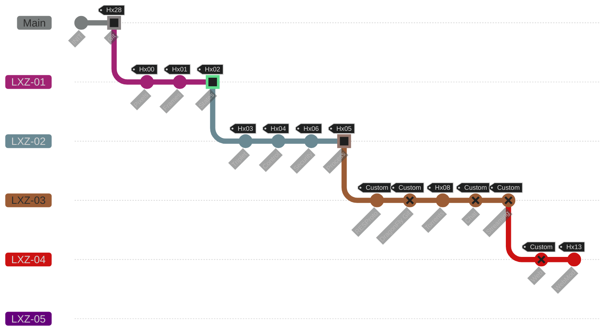

<!-- ANCHOR: D01 -->

```mermaid
%%{init: { 'logLevel': 'debug', 'theme': 'dark', 'gitGraph': {'showBranches': true, 'showCommitLabel': true, 'mainBranchName': 'Main'} } }%%
gitGraph  
    commit id: "INIT"
    commit id: "Git" tag: "Hx28" type: HIGHLIGHT
    branch LXZ-01
    checkout LXZ-01
    commit id: "Pixels" tag:"Hx00"
    commit id: "Frames" tag:"Hx01"
    commit id: "States" tag:"Hx02" type: HIGHLIGHT
    branch LXZ-02
    checkout LXZ-02
    commit id: "Triplet" tag:"Hx03"
    commit id: "Control" tag:"Hx04"
    commit id: "Security" tag:"Hx06"
    commit id: "Process" tag:"Hx05" type: HIGHLIGHT
    branch LXZ-03
    checkout LXZ-03
    commit id: "RESProto" tag: "Custom"
    commit id: "DragonFly Git" tag: "Custom" type: REVERSE
    commit id: "Torrents" tag:"Hx08"
    commit id: "Chat" tag: "Custom" type: REVERSE
    commit id: "Streaming" tag: "Custom" type:  REVERSE
    branch LXZ-04
    checkout LXZ-04
    commit id: "Web" tag: "Custom" type: REVERSE
    commit id: "WebMod" tag: "Hx13"
    branch LXZ-05
    checkout LXZ-05
    
```
<!-- ANCHOR_END: D01 -->
