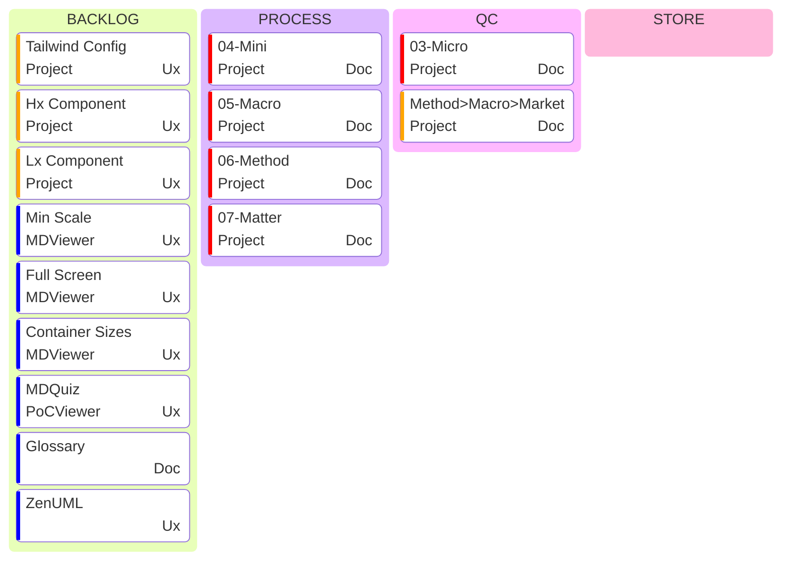

<!-- ANCHOR:DK1 -->

```mermaid
kanban
  column1[BACKLOG]
    task4[Tailwind Config]@{ ticket: Project , priority: 'High', assigned: 'Ux' }
    task5[Hx Component]@{ ticket: Project , priority: 'High', assigned: 'Ux' }
    task6[Lx Component]@{ ticket: Project , priority: 'High', assigned: 'Ux' }
    task1[Min Scale]@{ ticket: MDViewer, priority: 'Low', assigned: 'Ux'}
    task2[Full Screen]@{ ticket: MDViewer, priority: 'Low', assigned: 'Ux'}
    task3[Container Sizes]@{ ticket: MDViewer, priority: 'Low', assigned: 'Ux' }
    task13[MDQuiz]@{ ticket: PoCViewer , priority: 'Low', assigned: 'Ux'  }
    task14[Glossary]@{ ticket:Builtin , priority: 'Low', assigned:  'Doc'}
    task15[ZenUML]@{ ticket:MDViewer , priority: 'Low', assigned: 'Ux' }
  column2[PROCESS]
    task7[04-Mini]@{ ticket: Project , priority: 'Very High', assigned: 'Doc' }
    task9[05-Macro]@{ ticket: Project , priority: 'Very High', assigned: 'Doc' }
    task10[06-Method]@{ ticket: Project , priority: 'Very High', assigned: 'Doc' }
    task11[07-Matter]@{ ticket: Project , priority: 'Very High', assigned: 'Doc' }
  column3[QC]
    task8[03-Micro]@{ ticket: Project, priority: 'Very High', assigned: 'Doc' }
    task12[Method>Macro>Market]@{ ticket: Project, priority: 'High', assigned: 'Doc' }
  column4[STORE]
```
<!-- ANCHOR_END:DK1-->
